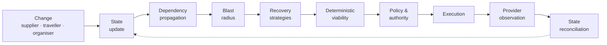
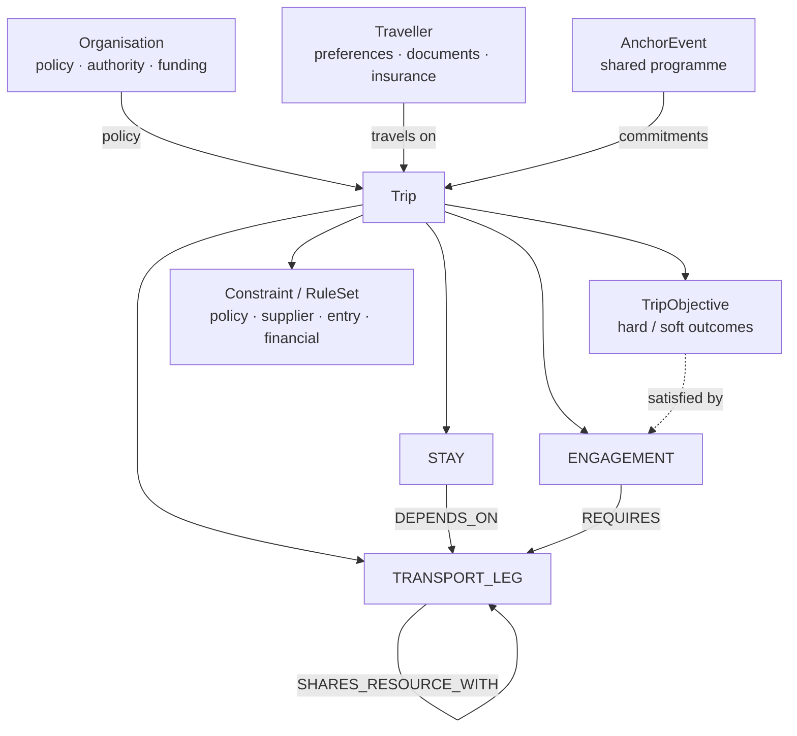
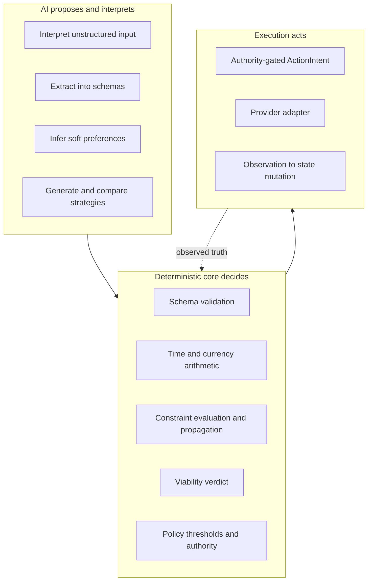
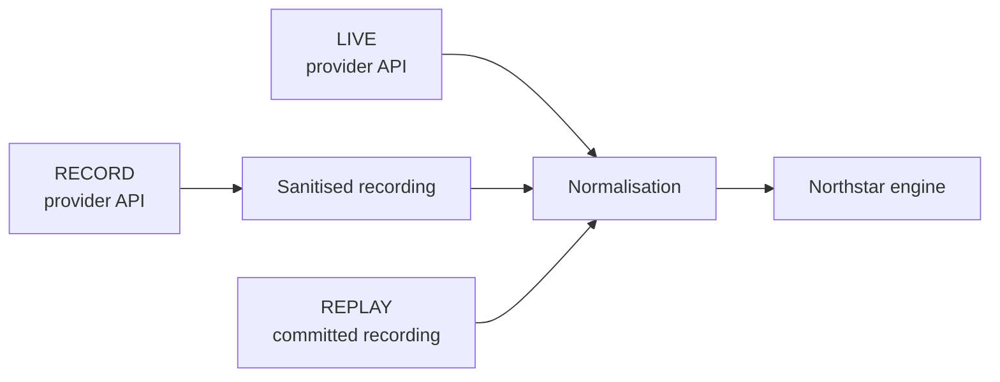

<div align="center">

# Northstar

**An AI travel resolution engine.**

*A booking gets you a ticket. Northstar gets you there.*

[Quickstart](#quickstart) · [How it works](#the-solution) · [Scenarios](#what-it-does--the-scenarios) · [Architecture](docs/ARCHITECTURE.md) · [What it can and cannot do](docs/CAPABILITIES_AND_LIMITATIONS.md)

</div>

---

## The problem

When a flight moves, the booking system rebooks the flight. Nobody checks whether the **trip** still works.

A speaker flying Tokyo → Singapore for a 09:00 keynote loses their connection. The airline offers a seat on the 07:40 arrival. Technically that is a recovery. Operationally it is a disaster:

- The keynote needs a 90-minute transfer plus venue check-in — the new arrival does not clear it.
- The hotel night before is now unused, and past its free-cancellation window.
- The replacement fare is 40% higher, in a different currency, and above the traveller's approval ceiling.
- Two colleagues were booked to travel with them on the original flight.

Today a human works that out — reading the itinerary, the programme, the policy, the fare rules and the hotel terms, then phoning suppliers. It is slow, it happens at 2am, and it is why "we have rebooked you" so often still means "you missed the thing you flew for."

> **A replacement flight is not necessarily a recovered trip.**

## The solution

Northstar holds a **Live Dependency Graph**: a persistent operational model of what a trip is *for* — objectives, commitments, constraints, sources, and the bookings that satisfy them.

When anything changes — a supplier disruption, a traveller request, an organiser moving the programme — Northstar works out what is actually at risk, proposes a recovery, checks it deterministically, obtains the required authority, executes only what is permitted, and reconciles what the provider actually did back into state.



A candidate strategy is a *proposed overlay* on authoritative state, not a fact. Only an **observed successful action** updates the trip.

## The Live Dependency Graph

Not a graph database — typed domain aggregates in SQLite, with explicit relations plus typed fields carrying the dependencies that matter operationally.



The executable relation vocabulary is deliberately small — `CONNECTS_TO`, `DEPENDS_ON`, `SHARES_RESOURCE_WITH`, `REQUIRES`. Everything else is a typed field, so propagation stays predictable and testable.

## Where AI sits — and where it does not



**No LLM directly invokes an irreversible or money-moving action.** A model can propose; it cannot mutate authoritative state, and it cannot assert viability — the deterministic evaluators own that verdict.

## Quickstart

Requires **Node.js 24+**. No credentials, no Docker, no database server.

```bash
npm install
npm run dev
```

Open `http://localhost:8787`.

Defaults to `REPLAY` mode against committed provider recordings and a local SQLite file, so the demo runs offline and reproducibly. The operator panel drives the scenarios below. `npm run build && npm start` runs the compiled build.

Optional provider configuration is documented in [Environment](docs/ENVIRONMENT.md). Never commit `.env` files or provider credentials.

## What it does — the scenarios

| # | Scenario | What it exercises |
|---|---|---|
| S1 | Airline schedule change | Supplier disruption, blast radius across linked commitments |
| S2 | Missed connection | Multi-step overnight recovery, hotel cancel-and-rebook, authority stop |
| S3 | Organiser programme change | Fan-out from an AnchorEvent to every linked traveller |
| S4 | Thursday morning arrival | Traveller-initiated change against policy and funding |
| S5 | Stay until Sunday | Stay extension with transfer and hotel impact |
| S6 | Switch hotels | Partner-inventory change and companion seat impact |
| S7 | Origin change to Tokyo | Re-origination with dated FX normalisation |
| S8 | Travel with the speakers | Shared-travel group change and disclosure |

Each is driven by an acceptance manifest through the real application endpoints — not a scripted UI. See [Scenarios](docs/SCENARIOS.md).

## LIVE / RECORD / REPLAY

One provider-normalisation path in every mode:



REPLAY is not a second, fake implementation. It replays real provider-shaped payloads through the same normalisation and the same engine — so the demo is credential-free, reproducible and resilient to provider downtime, while keeping real provider shapes at the system boundary.

## Stack

| Area | Implementation | Boundary |
|---|---|---|
| Runtime | TypeScript on Node 24, `node:http`, Zod | Single package, no web framework. One runtime dependency. |
| Persistence | `node:sqlite` behind repository interfaces | Zero native modules. Deployment needs a persistent volume. |
| AI | Alibaba Cloud Model Studio / Qwen | Schema-bound; LIVE when configured, deterministic fallback otherwise. |
| Flights | Atlas adapter | Sandbox-constrained transactions; provider-neutral domain model. |
| Hotels | Nuitée / liteAPI adapter | Date changes are cancel-and-rebook, not in-place modification. |
| Ground context | Google Routes adapter | Optional; falls back to sourced/deterministic context. |
| FX | Frankfurter / ECB reference rates | Comparison evidence, not a payment FX service. |
| Deployment | Railway | Operational evidence, not a product integration. |

Full status per capability — including what is **partial** and what is **deferred** — is in [Capabilities and limitations](docs/CAPABILITIES_AND_LIMITATIONS.md). Northstar does not claim provider coverage it does not have.

## Verify it

```bash
node --test --test-concurrency=1
```

```bash
npm run typecheck && npm run lint && npm run gate:anti-hardcoding
```

The suite covers contracts, deterministic evaluators, persistence, provider adapters, REPLAY normalisation, scenarios and integrated recovery paths. The anti-hardcoding gate is the interesting one: it executably asserts that no demo-specific identifier is baked into engine logic. See [Testing](docs/TESTING.md).

## Repository map

```
src/domain, src/engine        the model, graph semantics, deterministic core
src/intelligence              schema-bound Qwen integration and fallback planner
src/providers                 provider adapters and recording seams
src/app, src/server, src/ui   orchestration and operator/traveller surfaces
fixtures/                     versioned scenarios and sanitised recordings
docs/                         architecture, capabilities, scenarios, testing
```

## Documentation

- [Architecture](docs/ARCHITECTURE.md) — the graph, the ontology, the resolution path
- [Capabilities and limitations](docs/CAPABILITIES_AND_LIMITATIONS.md) — per-capability status
- [Scenarios](docs/SCENARIOS.md) — what each demo case proves
- [Testing](docs/TESTING.md) — how to verify the claims above
- [Environment](docs/ENVIRONMENT.md) — optional provider configuration
- [Build with Qoder](docs/BUILD_WITH_QODER.md) — how this was built
- [Roadmap](docs/ROADMAP.md)

---

Built for the **Atlas × Alibaba Cloud Agentic AI Hackathon**, with Qoder as the primary agentic development environment.
