<div align="center">

# Northstar

**An AI travel resolution engine.**

*A booking gets you a ticket. Northstar gets you there.*

[Quickstart](#quickstart) · [How it works](#how-it-works) · [Capability truth](docs/CAPABILITIES_AND_LIMITATIONS.md) · [Architecture](docs/ARCHITECTURE.md) · [Roadmap](docs/ROADMAP.md)

</div>

---

## The problem

A booking can be repaired while the **trip is still broken**.

A disruption can affect flights, hotels, ground transport, programme commitments,
traveller objectives, shared resources, entry context, policies, approvals and other
travellers. A replacement flight is therefore not necessarily a recovered trip.

Northstar maintains live operational state, evaluates the consequences of change, plans
whole-trip recovery, checks deterministic viability and authority, executes only permitted
actions, observes what actually happened and continues until the trip is valid or
explicitly escalated.

## How it works

```mermaid
flowchart LR
  C["Change / new information"] --> S["Canonical state"]
  S --> P["Affected scope + reassessment"]
  P --> RC["RecoveryCase"]
  RC --> D["Recovery domains + evidence gaps"]
  D --> T["Read-only research"]
  T --> R["Recovery candidates"]
  R --> V["Deterministic viability"]
  V --> M["Viable-only comparison / recommendation"]
  M --> A["Authority / approval"]
  A --> E["Execution"]
  E --> O["Observation / reconciliation"]
  O --> S
```



The consequential-action boundary is non-negotiable:

```text
proposal -> schema validation -> deterministic viability -> authority
         -> executor -> observation -> canonical state update
```

No LLM directly invokes an irreversible or money-moving API.

## Current architecture

**PostgreSQL + PostGIS is the sole normal Northstar runtime.** SQLite is retained only as
offline/read-only migration input and historical evidence.

The M0-M10/C5 state, evaluation, authority and durable-execution refactor remains accepted.
The 2026-09-18 product-parity rebase found that generalized planning/reasoning and the rich
decision surface were partially disconnected during convergence. NORTHSTAR is therefore
**not** being rebuilt.

The frozen forward loop is:

```text
ChangeSignal / request / new information
-> canonical state + deterministic reassessment
-> RecoveryCase
-> recovery-domain identification
-> bounded provider-neutral read-only evidence
-> StrategyProposer candidates
-> schema validation
-> RC-6 deterministic counterfactual viability
-> material planning/decision evidence
-> compare/recommend among VIABLE strategies
-> ActionPlan + authority / approval
-> execution
-> observation / canonical update
-> reassessment
-> resolve, continue planning from new state, or escalate
```

The existing internal programme loop and product-boundary repair are useful implemented
slices, not the complete rebased B1 acceptance proof.

See:

- [Recovery planning contract freeze](docs/RECOVERY_PLANNING_CONTRACT_FREEZE.md)
- [Architecture](docs/ARCHITECTURE.md)
- [Architecture closure](docs/DATA_STRUCTURE_ARCHITECTURE_CLOSURE.md)
- [Logical schema](docs/DATA_STRUCTURE_LOGICAL_SCHEMA.md)
- [Current implementation plan §22](docs/IMPLEMENTATION_PLAN.md)
- [Capabilities and limitations](docs/CAPABILITIES_AND_LIMITATIONS.md)

## Current delivery status

Current sequence:

`R1 planning/evidence parity
-> R2 Case decision surface
-> R3 full rebased B1
-> B2 consequential external execution / Jordan
-> post-E2E product + provider hardening
-> M11/C6`.

B1 includes read-only travel investigation/evaluation and cross-domain recommendation, but
does not require consequential external booking/payment execution. B2 proves the same
generalized engine when the selected strategy crosses an externally owned consequential
boundary.

See [Roadmap](docs/ROADMAP.md).

## Counterfactual recovery semantics

The dependency closure answers who must be reassessed. It is not a requirement that every
reached subject become perfect.

A viable recovery must:

- heal the blocking case subjects it is responsible for;
- introduce no regression to reached subjects;
- introduce no new/action-critical UNKNOWN;
- satisfy explicit required unknowns.

Unchanged unrelated pre-existing FAIL/UNKNOWN remains truthful but does not automatically
veto the candidate or become falsely healed.

Provider/API success alone never means recovered. Case resolution still requires
reconciled execution and fresh passing assessment of the required case subjects.

## Where AI sits

AI is used for messy interpretation, schema extraction, uncertainty detection, soft
preference inference, semantic consequence judgement, research and strategy proposal.

Deterministic code owns validation, authoritative mutation, arithmetic/timezone,
dependency/applicability propagation, policy thresholds, authority, state transitions,
viability, execution validation and reconciliation.

AI output is proposal/evidence transformation, never final provider truth or execution
authority.

## Quickstart

Requires Node.js 24+, PostgreSQL/PostGIS and the target runtime environment.

```bash
npm install
npm run db:postgres:up
npm run dev
```

Put a stable `PG_TARGET_WORKSPACE_ID` and `NORTHSTAR_DEMO_DATASET_DIR` in `.env.local`
(see `.env.example`). Open `http://localhost:8787`.

For daily development, **reuse the same workspace ID**. A new workspace intentionally
re-materializes the full AiT world and reruns the baseline, which can add about a minute
to startup. Use a fresh UUID only when you explicitly need a clean independent world.

See [Environment](docs/ENVIRONMENT.md) for target/demo variable loading.

## Verify

Use the manifest-backed commands; do not run raw `node --test` as the canonical gate.

```bash
npm test                         # boundary + CURRENT_TARGET
npm run test:postgres            # full PostgreSQL integration checkpoint gate
npm run test:migration           # migration boundary
npm run typecheck
npm run lint
npm run gate:anti-hardcoding
```

The full PostgreSQL gate is intentionally heavy (~21 minutes on the B1 code line) and is
not a debugging loop. Use focused tests first.

See [Testing](docs/TESTING.md).

## Provider boundaries

| Area | Current boundary |
|---|---|
| AI | Alibaba Cloud Model Studio/Qwen-capable proposal/extraction boundary; deterministic gates remain authoritative. |
| Flights | Atlas LIVE/RECORD/REPLAY search/verify/rules seams already exist; R1 composes read-only evidence into planning, while B2 adds consequential external dispatch. |
| Hotels | Nuitée/liteAPI search/quote/book/retrieve/cancel provider seams. |
| Ground context | Google Routes optional routing context, no booking action. |
| FX | Frankfurter/ECB-reference comparison evidence, not payment FX. |
| Deployment | Railway hosting; readiness semantics still need final-candidate hardening. |

Provider adapters are not the architecture.

## Scenario proofs

The repository contains eight frozen scenario narratives in
[SCENARIOS.md](docs/SCENARIOS.md). Demo facts live in data/fixtures/config, never in
domain/application branches.

Current critical proofs:

- **Sarah** — rebased B1: provider reprotection, travel investigation/evaluation, programme alternatives, viable-only recommendation, internal execution and final recovery through one generalized planner.
- **Jordan** — B2: materially different proof of the same planner/lifecycle under consequential external-provider execution.

The broader acceptance corpus covers families/groups, shared bookings, programme changes,
entry/advisory context, provider failure, concurrency and extensibility.

## Repository map

```text
src/domain, src/resolution       typed domain + deterministic evaluation/planning
src/persistence/postgres        sole normal runtime persistence
src/app, src/server, src/ui     product/runtime composition and surfaces
src/providers                   provider adapters and LIVE/RECORD/REPLAY seams
src/intelligence                schema-bound model integration
fixtures/, data/                scenario/source/demo facts
postgres-integration/           current PostgreSQL integration/acceptance tests
docs/                           architecture, current plan, evidence and handoffs
```

## Documentation

Start at [docs/README.md](docs/README.md).

The main sources are:

- [Architecture](docs/ARCHITECTURE.md)
- [Capabilities and limitations](docs/CAPABILITIES_AND_LIMITATIONS.md)
- [Roadmap](docs/ROADMAP.md)
- [Implementation plan §22](docs/IMPLEMENTATION_PLAN.md)
- [Testing](docs/TESTING.md)
- [Environment](docs/ENVIRONMENT.md)
- [Agent model selection](docs/AGENT_MODEL_SELECTION.md)

---

Originally built for the **Atlas × Alibaba Cloud Agentic AI Hackathon**. The current code
preserves that generalized recovery thesis while using the accepted PostgreSQL operational
model and deterministic safety boundaries.
