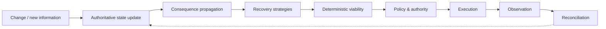
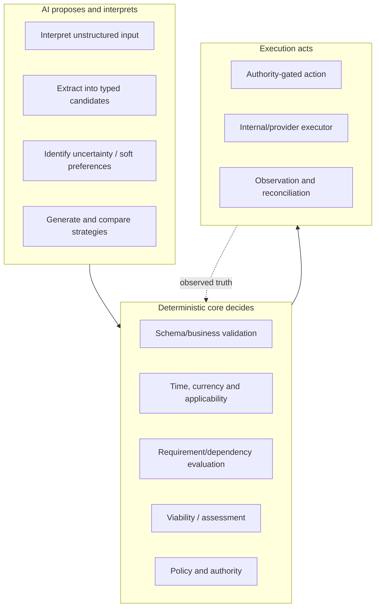
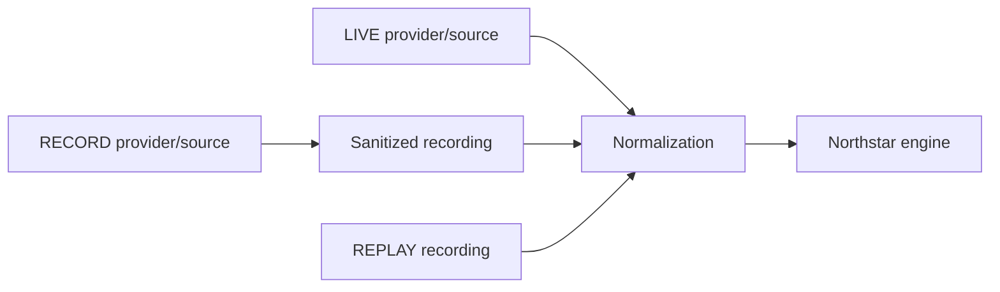

<div align="center">

# Northstar

**An AI travel resolution engine.**

*A booking gets you a ticket. Northstar gets you there.*

[Quickstart](#quickstart) · [How it works](#how-it-works) · [Current capability truth](docs/CAPABILITIES_AND_LIMITATIONS.md) · [Architecture](docs/ARCHITECTURE.md) · [Roadmap](docs/ROADMAP.md)

</div>

---

## The problem

When a flight moves, a booking system can repair the booking without checking whether the **journey still achieves its purpose**.

A disruption can affect flights, hotels, ground transport, programme commitments, objectives, policies, approvals, entry feasibility, shared travellers and downstream dependencies. A replacement flight is therefore not necessarily a recovered trip.

## How it works

Northstar maintains operational state for the journey and the things it depends on. When a supplier, traveller, organiser or external condition changes, Northstar determines what is affected, proposes recovery strategies, evaluates them deterministically, checks authority, executes only permitted actions and reconciles observed outcomes back into state.



A candidate strategy is hypothetical. It cannot rewrite the current world merely because a model proposed it.

**No LLM directly invokes an irreversible or money-moving action.**

## Architecture transition

Northstar currently has a working **legacy runtime** from the Atlas × Alibaba Cloud hackathon and an **approved production-oriented target refactor**.

Do not confuse them:

- **Current runtime:** TypeScript/Node, SQLite-backed legacy Trip/RecoveryCase aggregates, current provider adapters and existing acceptance scenarios.
- **Approved target:** PostgreSQL + PostGIS; stable Traveller identity; shared Trip + per-person Journey; independent services/reservations; real Programme/ProgrammeItem/Participation state; explicit external-information/advisory/entry semantics; multi-object Assessments and durable authority/execution/reconciliation.

The target is frozen in:

- [Architecture closure](docs/DATA_STRUCTURE_ARCHITECTURE_CLOSURE.md)
- [Logical schema](docs/DATA_STRUCTURE_LOGICAL_SCHEMA.md)
- [Implementation plan](docs/IMPLEMENTATION_PLAN.md)

The target is **not implemented merely because it is documented**. [Capabilities and limitations](docs/CAPABILITIES_AND_LIMITATIONS.md) remains the source for what works today.

## Current Live Dependency Graph

The current application assembles an operational dependency graph from typed domain aggregates and relationships. It is not a dedicated graph database.

The approved refactor keeps the same product principle while changing ownership boundaries: ordinary relationships become relational references; explicit executable dependencies are used only where propagation semantics require them; applicability matching handles geography/population/time-wide information such as advisories and future weather conditions.

See [Architecture](docs/ARCHITECTURE.md) for the current/target distinction.

## Where AI sits — and where it does not



AI output is never enough to establish provider success, legal certainty or recovered-trip status.

## Quickstart — current runtime

Requires **Node.js 24+**.

```bash
npm install
npm run dev
```

Open `http://localhost:8787`.

The current application defaults to credential-free `REPLAY` against committed provider recordings and a local SQLite file, allowing the existing runtime to run reproducibly without provider credentials. `npm run build && npm start` runs the compiled build.

Optional provider configuration is documented in [Environment](docs/ENVIRONMENT.md). Never commit `.env` files or provider credentials.

The refactor implementation will add PostgreSQL/PostGIS setup through M0-M11; do not infer those runtime instructions before the corresponding milestones land.

## Current provider boundaries

| Area | Current implementation | Boundary |
|---|---|---|
| AI | Alibaba Cloud Model Studio / Qwen | Schema-bound; LIVE when configured, deterministic fallback otherwise. |
| Flights | Atlas | Sandbox-constrained search/servicing/transaction seams. |
| Hotels | Nuitée / liteAPI | Search/quote/book/retrieve/cancel; date change is cancel/rebook. |
| Ground context | Google Routes | Optional routing context; no booking action. |
| FX | Frankfurter / ECB-reference data | Comparison evidence, not payment FX. |
| Deployment | Railway | Hosting evidence, not domain functionality. |

Provider adapters are not the architecture. Future GDS/TMC, advisory, entry, weather and other sources must enter through the approved ownership/capability/information boundaries.

## Current scenarios

| # | Scenario | What it exercises |
|---|---|---|
| S1 | Airline schedule change | Supplier disruption and downstream impact |
| S2 | Missed connection | Multi-step overnight recovery and authority stop |
| S3 | Organiser programme change | Shared commitment fan-out |
| S4 | Thursday morning arrival | Traveller-initiated change against policy/funding |
| S5 | Stay until Sunday | Stay extension and downstream impact |
| S6 | Switch hotels | Hotel/provider change and shared effects |
| S7 | Origin change to Tokyo | Re-origination and dated FX normalization |
| S8 | Travel with the speakers | Shared-travel/group change and disclosure |

These are current-runtime acceptance/demo assets, not target-domain hardcoding. The refactor acceptance set additionally covers families/groups, shared bookings, entry/advisory changes, programme consequences, concurrency/migration and unprecedented-data extensibility through AT01-AT24.

## LIVE / RECORD / REPLAY

Where supported, the current adapters use one normalization/downstream path:



REPLAY is an external-boundary fallback, not a second fake internal engine.

## Verify the current runtime

```bash
node --test --test-concurrency=1
npm run typecheck
npm run lint
npm run gate:anti-hardcoding
```

Use [Testing](docs/TESTING.md) for current-runtime verification rules. Refactor-specific M0-M11/C0-C6/AT01-AT24 requirements are in the [Implementation plan](docs/IMPLEMENTATION_PLAN.md).

## Repository map

```text
src/domain, src/engine        current domain + deterministic core
src/intelligence              schema-bound model integration / fallback planner
src/providers                 provider adapters and recording seams
src/app, src/server, src/ui   orchestration and current surfaces
src/persistence               current SQLite persistence; target Postgres work lands by milestones
fixtures/                     versioned scenarios and sanitized recordings
docs/                         current truth + approved target architecture/refactor plan
```

## Documentation

- [Documentation index](docs/README.md)
- [Architecture](docs/ARCHITECTURE.md)
- [Architecture closure](docs/DATA_STRUCTURE_ARCHITECTURE_CLOSURE.md)
- [Logical schema](docs/DATA_STRUCTURE_LOGICAL_SCHEMA.md)
- [Implementation plan](docs/IMPLEMENTATION_PLAN.md)
- [Capabilities and limitations](docs/CAPABILITIES_AND_LIMITATIONS.md)
- [Roadmap](docs/ROADMAP.md)
- [Testing](docs/TESTING.md)
- [Agent model selection](docs/AGENT_MODEL_SELECTION.md)
- [Implementation agent routing](docs/IMPLEMENTATION_AGENT_ROUTING.md)
- [Environment](docs/ENVIRONMENT.md)

---

Originally built for the **Atlas × Alibaba Cloud Agentic AI Hackathon**. The current refactor is moving the same generalized recovery thesis toward a production-oriented data/state foundation.
