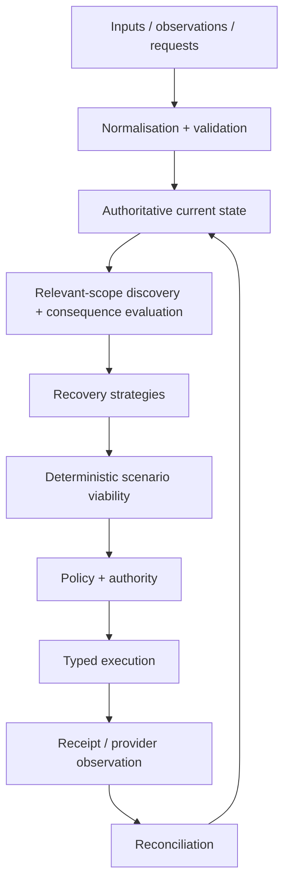
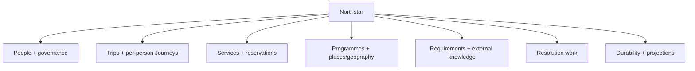

# Northstar architecture

Northstar is an **AI Travel Resolution Engine** built around a persistent operational model of a journey, its purpose, dependencies, requirements and recovery state.

The graph/state model is central. Chat, dashboards and traveller surfaces are interfaces over it; none is the source of truth.



The non-negotiable consequential-action boundary is:

```text
AI proposal -> validation -> deterministic viability -> authority
            -> executor -> observation -> state update
```

An LLM cannot directly mutate authoritative state or invoke an irreversible or money-moving action.

## Architecture status: current runtime vs approved target

Northstar is in a controlled architecture refactor. Two truths must remain separate until cutover:

1. **Current implemented runtime** — the submitted/hardened application that still uses the legacy aggregate model and SQLite persistence.
2. **Approved target architecture** — the production-oriented model frozen in the data-structure refactor and scheduled through M0-M11.

The target is normative for new refactor implementation. The current runtime remains implementation truth until target paths actually land and the controlled cutover occurs.

Normative target documents:

- [`DATA_STRUCTURE_ARCHITECTURE_CLOSURE.md`](DATA_STRUCTURE_ARCHITECTURE_CLOSURE.md) — F01-F18, canonical ontology, ownership, lifecycles and extension semantics.
- [`DATA_STRUCTURE_LOGICAL_SCHEMA.md`](DATA_STRUCTURE_LOGICAL_SCHEMA.md) — relational schema, integrity, transaction and persistence contracts.
- [`IMPLEMENTATION_PLAN.md`](IMPLEMENTATION_PLAN.md) — M0-M11 execution, C0-C6 gates and AT01-AT24 architecture acceptance.

## Current implemented architecture

The current runtime persists typed domain aggregates in SQLite behind repositories. Its operational graph is assembled from typed aggregate fields plus explicit `TripRelation` records.

Current principal concepts are:

| Current object | Current role |
|---|---|
| Organisation | Policy/operation/approval/payer/duty-of-care context. |
| Traveller | Person/profile context including arrangement declaration and sourced passport/nationality information. |
| AnchorEvent / AnchorCommitment | Shared event/programme context and addressable commitments. |
| Trip | Aggregate containing one or more travellers, elements, objectives, relations, policy references and stored viability. |
| TripElement | `TRANSPORT_LEG`, `STAY` or `ENGAGEMENT`, combining intended journey state with reservation/health fields. |
| TripObjective | Hard/soft outcomes linked to elements. |
| Place | Operational location/timezone/coordinates/provider refs. |
| RuleSet / Constraint | Sourced policy and executable conditions. |
| TripSignal | Normalised disruption/request/event-side change. |
| RecoveryCase / RecoveryStrategy | Resolution workflow and hypothetical recovery candidates. |
| ActionIntent | Authority-gated consequential operation request. |

This model remains useful as a compatibility/runtime baseline, but it is **not the approved target ownership model**. In particular, current Trip/TripElement/AnchorCommitment/Constraint persistence combines concepts that the target architecture separates.

## Approved target domain hierarchy

The target remains a modular monolith with deterministic domain/evaluation code separated from persistence, connectors and delivery workers.

At a high level:



Key ownership decisions:

- **Workspace** is the data/access partition. **Organisation** is a business party.
- **Traveller** is a stable person.
- **Trip** is a shared undertaking/purpose.
- **Journey** belongs to exactly one Traveller and one Trip and owns that person's intended itinerary.
- **Reservation / ReservationLine / Allocation** represent supplier commitments and shared use; a booking is not owned by whichever Journey imported it first.
- **TransportService / Resource** represent shared operational fulfilment independently from traveller intention.
- **Event -> Programme -> ProgrammeItem** is real mutable programme state.
- **Participation** links a Traveller to a ProgrammeItem independently of whether that person has travel.
- **TravelCredential, IntendedVisit and credential selection** support traveller- and itinerary-specific entry/transit reasoning.
- **InformationRecord / InformationVersion, Source/Evidence, RuleSet versions and coverage** preserve source-specific claims, freshness, applicability and uncertainty for advisories, conditions and regulatory requirements.
- **RecoveryCase, Strategy, Assessment, ActionPlan/Intent, AuthorityDecision and ExecutionAttempt** coordinate resolution without becoming a second copy of current-world truth.

Detailed properties/cardinalities belong only in the architecture-closure/logical-schema documents rather than being duplicated here.

## One owner for each kind of truth

The target distinguishes five classes of information:

1. **Observed** — what a provider, publisher, person or external system reports.
2. **Intended** — what the traveller/organisation plans to do.
3. **Required** — policies, legal/operational requirements, objectives and constraints that must hold.
4. **Proposed** — hypothetical recovery changes under evaluation.
5. **Computed** — assessments, viability, exposure and other deterministic conclusions.

A value has one canonical current owner. Other surfaces may project/cache it, but a projection is explicitly non-authoritative and carries enough revision/generation context to detect staleness.

Examples:

- Programme time/location belongs to `ProgrammeItem`, not copied editable Engagement fields.
- Supplier booking state belongs to Reservation/line observations, not Journey intent.
- Desired travel windows belong to Journey/JourneyItem and never overwrite provider schedules.
- Entry eligibility and trip viability are computed assessments, not fields a model/user edits.
- Submitting an externally owned change is not success; observation/reconciliation establishes the new provider state.

## Relationships and the operational graph

Northstar does not require a graph database. Most relationships should be normal relational/domain references.

Use explicit executable dependency semantics only where ordinary ownership/reference links are insufficient. The approved generic dependency vocabulary starts with:

- `CONNECTS_TO` — upstream context affects downstream connection/order feasibility; failure triggers reevaluation rather than blanket invalidation.
- `REQUIRES` — a subject depends on a prerequisite through a registered requirement/evaluator.

Travel-together, accompaniment, co-presence, capacity and similar conditions are typed requirements, not vague graph edges.

Consequence propagation is therefore deliberate:

```text
change/new evidence
 -> discover potentially affected subjects using reverse references/dependencies/applicability
 -> load sufficient current context
 -> run registered deterministic evaluators
 -> record a revision/time/evidence-bound Assessment
 -> open/update recovery work only where action/investigation is needed
```

Geography/population/time-wide information such as advisories or weather should use applicability matching rather than permanent edges from every publication to every traveller.

## External information and extensibility

The target does not attempt to predict every future travel-data category. It defines stable extension rules.

A new category must establish:

- whether it is observed information, internally owned state, requirement, intention or computed result;
- stable identity/lifecycle where warranted;
- provenance, ordering, freshness and coverage;
- applicability by entity/geography/population/time;
- deterministic consumer/evaluator semantics;
- reverse applicability/dependency discovery;
- assessment invalidation rules;
- optional action capability if Northstar can do something about it.

Weather, new regulatory publications, resource availability and future trip-relevant information can therefore add typed modules/subtypes/evaluators without changing what Trip, Journey, Programme, Reservation, Assessment or RecoveryCase mean.

Do not solve extensibility with a generic entity-attribute-value/JSON dumping ground.

## Programme and group semantics

Programme state is no longer treated as seed-only context in the target architecture. Moving/cancelling a ProgrammeItem is an authoritative domain change (or an externally owned request awaiting observation) that can affect many participations/Journeys and must be evaluated through the same consequence/recovery machinery.

Group travel is represented without a universal main/sub-traveller hierarchy:

- one shared Trip can contain several per-person Journeys;
- relationships such as guardianship/support are sourced associations;
- accompaniment/co-presence requirements are explicit operational requirements;
- booking allocations separately state who uses a shared reservation;
- authority grants separately state who may consent/spend/act;
- CoordinationGroups represent scoped subsets when coordinated decisions are actually needed.

A group can diverge/reconverge without duplicating people/bookings or losing individual entry/viability results.

## Advisory and entry semantics

Travel advisories/conditions preserve publisher-specific versions, source-native levels/text, applicability, effective dates, supersession/retraction, provenance and coverage. There is no universal 'highest authority wins' risk field. Fast emerging reports and slower official guidance may coexist; organisational policy determines how each affects action/approval while the original claims remain distinguishable.

Entry/transit feasibility is traveller- and itinerary-specific. Credentials, intended visits, document selections, route/transit context and versioned authoritative requirements feed deterministic three-valued evaluation. Missing coverage remains `UNKNOWN`; an organisation cannot approve a legal requirement into `PASS`.

The architecture supports these domains. Current provider/source integrations do **not** yet constitute legal-grade live entry/advisory coverage; implementation truth remains in `CAPABILITIES_AND_LIMITATIONS.md`.

## Deterministic and agentic responsibilities

| Agentic | Deterministic |
|---|---|
| Interpret unstructured input, extract candidates, identify uncertainty, infer soft preferences, judge semantic consequences, propose/compare strategies | Schema/business validation, authoritative mutation, money/time arithmetic, applicability/dependency propagation, policy thresholds, authority, lifecycle transitions, viability, execution validation and reconciliation |

AI outputs are proposals/evidence transformations subject to typed validation. They cannot create provider facts, legal certainty or execution authority.

## Persistence

### Current baseline

The current runtime uses SQLite JSON-oriented repositories. It remains the current application authority until the approved refactor reaches cutover.

### Approved target

The target uses **PostgreSQL + PostGIS** with:

- relational identity/ownership and foreign keys;
- typed domain tables instead of whole mutable Trip/Journey/Programme/Case JSON blobs;
- bounded JSON only for appropriate immutable/provider/rule/proposal detail;
- aggregate revisions and expected-revision commands;
- idempotency receipts/change records;
- short transactions, deterministic locking/serializable retries where required;
- durable inbox/outbox/scheduled reassessment work;
- explicit migration/reconciliation rather than routine dual-writing.

No graph database, event-sourcing requirement, Kafka, Kubernetes or microservice split is implied by this design.

## Provider and external-system boundaries

Atlas, Nuitée/liteAPI, Google Routes, Frankfurter, Model Studio and future GDS/TMC/advisory/entry/weather systems are provider/source adapters, not the product architecture.

Where practical:

```text
LIVE   -> provider/source -> normalization -> Northstar
RECORD -> provider/source -> sanitized provider-shaped recording -> normalization -> Northstar
REPLAY -> recording -> normalization -> Northstar
```

LIVE and REPLAY share downstream semantics. Mocks remain at external boundaries; internal state, evaluation, authority and reconciliation stay real.

Future external systems may be observation-only, serviceable through a partner, or authoritative owners of specific field groups. Observability never implies mutability.

## Interfaces

Operator and traveller surfaces project from the same canonical state and assessment currency. UI terminology should answer operational questions without exposing internal graph/agent jargon.

The current runtime surfaces remain valid baseline evidence. Target API/read-model changes land only through the implementation milestones and are not claimed complete until their acceptance gates pass.
