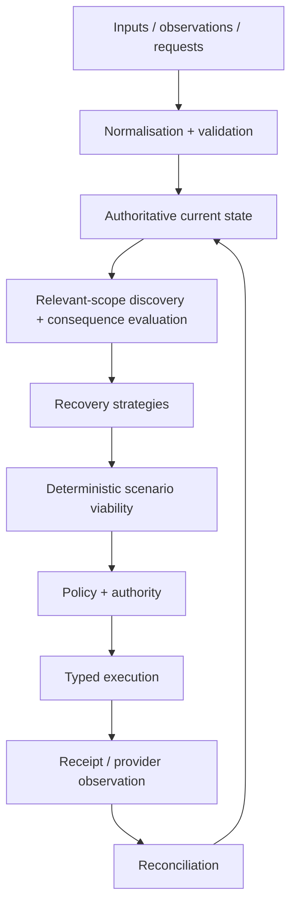

# Northstar architecture

Northstar is an **AI Travel Resolution Engine** built around a persistent operational model of a journey, its purpose, dependencies, requirements and recovery state.

The graph/state model is central. Chat, dashboards and traveller surfaces are interfaces over it; none is the source of truth.



The non-negotiable consequential-action boundary is:

```text
AI proposal -> validation -> deterministic viability -> authority
            -> executor -> observation -> state update
```

An LLM cannot directly mutate authoritative state or invoke an irreversible or money-moving action.

## Architecture status: post-C5 implemented foundation

The M0-M10 data/state refactor is implemented and accepted through **C5**. Post-C5 repository convergence is complete.

**PostgreSQL + PostGIS is the sole normal NORTHSTAR runtime.** SQLite is retired as an application runtime and survives only as explicit offline, read-only migration input plus historical code/test evidence.

The remaining work is no longer a persistence-architecture migration. It is product delivery and operational activation:

1. Slice A — baseline -> disruption -> authoritative affected outcomes -> Sarah case.
2. Founder Test A.
3. Slice B — preview -> approval -> execution -> observation -> reassessment -> recovery.
4. Founder Test B.
5. Submission rehearsal and M11 operational activation/retirement.
6. Polish/stretch.

Normative architecture documents:

- [`DATA_STRUCTURE_ARCHITECTURE_CLOSURE.md`](DATA_STRUCTURE_ARCHITECTURE_CLOSURE.md) — F01-F18, canonical ontology, ownership, lifecycles and extension semantics.
- [`DATA_STRUCTURE_LOGICAL_SCHEMA.md`](DATA_STRUCTURE_LOGICAL_SCHEMA.md) — relational schema, integrity, transaction and persistence contracts.
- [`IMPLEMENTATION_PLAN.md`](IMPLEMENTATION_PLAN.md) — historical M0-M11 execution decomposition plus the current post-C5 delivery sequence in Section 22.
- [`CAPABILITIES_AND_LIMITATIONS.md`](CAPABILITIES_AND_LIMITATIONS.md) — current implementation truth and limitations.
- [`ROADMAP.md`](ROADMAP.md) — current milestone status and deferred scope.

Historical milestone evidence under `docs/refactor/evidence/**` records what was true at each checkpoint and should not be rewritten to match the present runtime.

## Current implemented architecture

The current runtime is a PostgreSQL-backed modular monolith with deterministic domain/evaluation code separated from persistence, provider adapters and delivery workers.

Core ownership concepts are:

| Object | Current role |
|---|---|
| Workspace | Data/access partition and top-level operational scope. |
| Organisation | Business party for policy, payer, duty-of-care and approval context. |
| Traveller | Stable person identity. |
| Trip | Shared undertaking/purpose that may contain several travellers. |
| Journey | One Traveller's independently managed participation in a Trip. |
| JourneyItem | Intended travel/programme participation owned by a Journey. |
| TransportService / Resource | Shared operational fulfilment independent of traveller intent. |
| Reservation / ReservationLine / Allocation / Entitlement | Supplier commitments, shared use and traveller allocation. |
| Event -> Programme -> ProgrammeItem | Mutable event/programme truth. |
| Participation | Person-to-programme participation independent of whether that person has a Journey. |
| RuleSet / Constraint / Requirement | Sourced or internal rules evaluated deterministically. |
| InformationRecord / InformationVersion / Evidence | Versioned external knowledge, provenance, freshness and coverage. |
| Assessment | Immutable computed result bound to revisions/generations/evidence/time. |
| RecoveryCase / RecoveryStrategy / ActionPlan | Resolution work over current state and proposed changes. |
| AuthorityDecision / ActionIntent / ExecutionAttempt / Observation | Consequential-action safety, durable execution and reconciliation. |

Legacy aggregate/SQLite modules remain in-tree only for migration/historical evidence. They are structurally unreachable from the normal runtime.

## One owner for each kind of truth

NORTHSTAR distinguishes five classes of information:

1. **Observed** — what a provider, publisher, person or external system reports.
2. **Intended** — what the traveller/organisation plans to do.
3. **Required** — policies, legal/operational requirements, objectives and constraints that must hold.
4. **Proposed** — hypothetical recovery changes under evaluation.
5. **Computed** — assessments, viability, exposure and other deterministic conclusions.

A value has one canonical current owner. Other surfaces may project/cache it, but a projection is explicitly non-authoritative and carries enough revision/generation context to detect staleness.

Examples:

- Programme time/location belongs to `ProgrammeItem`, not copied editable Engagement fields.
- Supplier booking state belongs to Reservation/line observations, not Journey intent.
- Desired travel windows belong to Journey/JourneyItem and never overwrite provider schedules.
- Entry eligibility and trip viability are computed assessments, not fields a model/user edits.
- Submitting an externally owned change is not success; observation/reconciliation establishes the new provider state.

## Relationships and the operational graph

NORTHSTAR does not require a graph database. Most relationships are normal relational/domain references.

Use explicit executable dependency semantics only where ordinary ownership/reference links are insufficient. The generic dependency vocabulary starts with:

- `CONNECTS_TO` — upstream context affects downstream connection/order feasibility; failure triggers reevaluation rather than blanket invalidation.
- `REQUIRES` — a subject depends on a prerequisite through a registered requirement/evaluator.

Travel-together, accompaniment, co-presence, capacity and similar conditions are typed requirements, not vague graph edges.

Consequence propagation is deliberate:

```text
change/new evidence
 -> discover potentially affected subjects using reverse references/dependencies/applicability
 -> load sufficient current context
 -> run registered deterministic evaluators
 -> record a revision/time/evidence-bound Assessment
 -> open/update recovery work only where action/investigation is needed
```

Geography/population/time-wide information such as advisories or weather should use applicability matching rather than permanent edges from every publication to every traveller.

## External information and extensibility

The architecture does not attempt to predict every future travel-data category. A new category must establish:

- whether it is observed information, internally owned state, requirement, intention or computed result;
- stable identity/lifecycle where warranted;
- provenance, ordering, freshness and coverage;
- applicability by entity/geography/population/time;
- deterministic consumer/evaluator semantics;
- reverse applicability/dependency discovery;
- assessment invalidation rules;
- optional action capability if NORTHSTAR can do something about it.

Weather, new regulatory publications, resource availability and future trip-relevant information can therefore add typed modules/subtypes/evaluators without changing what Trip, Journey, Programme, Reservation, Assessment or RecoveryCase mean.

Do not solve extensibility with a generic entity-attribute-value/JSON dumping ground.

## Programme and group semantics

Programme state is real mutable domain state. Moving/cancelling a ProgrammeItem is an authoritative domain change (or an externally owned request awaiting observation) that can affect many participations/Journeys and must be evaluated through the same consequence/recovery machinery.

Group travel is represented without a universal main/sub-traveller hierarchy:

- one shared Trip can contain several per-person Journeys;
- relationships such as guardianship/support are sourced associations;
- accompaniment/co-presence requirements are explicit operational requirements;
- booking allocations separately state who uses a shared reservation;
- authority grants separately state who may consent/spend/act;
- CoordinationGroups represent scoped subsets when coordinated decisions are actually needed.

A group can diverge/reconverge without duplicating people/bookings or losing individual entry/viability results.

## Advisory and entry semantics

Travel advisories/conditions preserve publisher-specific versions, source-native levels/text, applicability, effective dates, supersession/retraction, provenance and coverage. There is no universal "highest authority wins" risk field. Fast emerging reports and slower official guidance may coexist; organisational policy determines how each affects action/approval while the original claims remain distinguishable.

Entry/transit feasibility is traveller- and itinerary-specific. Credentials, intended visits, document selections, route/transit context and versioned authoritative requirements feed deterministic three-valued evaluation. Missing coverage remains `UNKNOWN`; an organisation cannot approve a legal requirement into `PASS`.

The architecture and evaluator boundaries for these domains are implemented. Current provider/source coverage does **not** constitute legal-grade live entry/advisory coverage; implementation truth remains in `CAPABILITIES_AND_LIMITATIONS.md`.

## Deterministic and agentic responsibilities

| Agentic | Deterministic |
|---|---|
| Interpret unstructured input, extract candidates, identify uncertainty, infer soft preferences, judge semantic consequences, propose/compare strategies | Schema/business validation, authoritative mutation, money/time arithmetic, applicability/dependency propagation, policy thresholds, authority, lifecycle transitions, viability, execution validation and reconciliation |

AI outputs are proposals/evidence transformations subject to typed validation. They cannot create provider facts, legal certainty or execution authority.

## Persistence

### Current runtime

The current runtime uses **PostgreSQL + PostGIS** with:

- relational identity/ownership and foreign keys;
- typed domain tables instead of whole mutable Trip/Journey/Programme/Case JSON blobs;
- bounded JSON only for appropriate immutable/provider/rule/proposal detail;
- aggregate revisions and expected-revision commands;
- idempotency receipts/change records;
- short transactions, deterministic locking/serializable retries where required;
- durable inbox/outbox/scheduled reassessment work;
- explicit migration/reconciliation rather than routine dual-writing.

### Retired SQLite boundary

SQLite is not an application runtime. It remains only for:

- read-only legacy migration sources;
- deterministic migration/rehearsal fixtures;
- historical tests and code archaeology.

`test/m10-runtime-purge.test.ts` and `npm run gate:test-boundary` enforce that live runtime/current tests cannot reach the retired composition.

No graph database, event-sourcing requirement, Kafka, Kubernetes or microservice split is implied by this design.

## Provider and external-system boundaries

Atlas, Nuitée/liteAPI, Google Routes, Frankfurter, Model Studio and future GDS/TMC/advisory/entry/weather systems are provider/source adapters, not the product architecture.

Where practical:

```text
LIVE   -> provider/source -> normalization -> NORTHSTAR
RECORD -> provider/source -> sanitized provider-shaped recording -> normalization -> NORTHSTAR
REPLAY -> recording -> normalization -> NORTHSTAR
```

LIVE and REPLAY share downstream semantics. Mocks remain at external boundaries; internal state, evaluation, authority and reconciliation stay real.

Future external systems may be observation-only, serviceable through a partner, or authoritative owners of specific field groups. Observability never implies mutability.

## Read models and interfaces

Operator and traveller surfaces project from the same canonical state and assessment currency. UI terminology should answer operational questions without exposing internal graph/agent jargon.

The accepted frontend semantic boundary is:

`authoritative backend/read model -> semantic adapter -> normalized presentation model -> shared visual grammar -> UI`

The accepted live read-model contract supplies stable relation identity/authority, monotonic change cursor, assessment lifecycle exposure, subject-keyed refs and authoritative traveller naming. Frontends apply the **complete authoritative snapshot**; `changedVisibleRefs` is an at-least-once transition/emphasis hint, not an exact diff.

The focused V5.6 case graph is an accepted visual reference, not an authoritative data fixture.

The final Event Overview visual design is unresolved. Do not create backend-specific semantics solely to satisfy a rejected prototype.

## Current delivery boundary

The next product proof is Slice A:

`known Sarah baseline -> provider-shaped disruption through normal HTTP -> PostgreSQL mutation/evaluation -> incident-linked five-person outcome -> four cleared/Sarah failed -> one Sarah case -> click/reload authoritative case`

Only after founder testing that slice should Slice B add strategy/preview/approval/execution/observation/recovery.

M11 follows proven product slices as an **operational activation/retirement** milestone, not a return to or migration from an active SQLite runtime.
