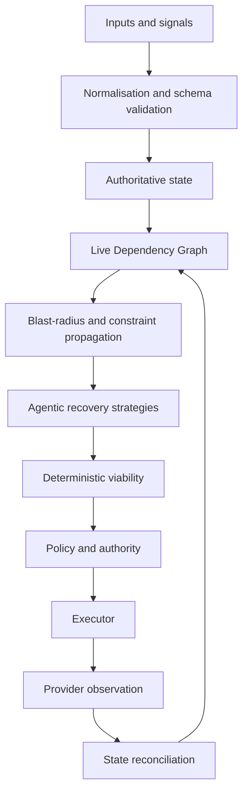

# Northstar architecture

Northstar is an **AI Travel Resolution Engine** built around a **Live Dependency
Graph**: a persistent operational model of the traveller's journey, objectives,
constraints and dependencies.

The graph/state model is central. Chat and dashboards are interfaces over it; neither
is the source of truth.



The required consequential-action path is:

```text
AI proposal → validation → deterministic viability → authority → executor
            → observation → state update
```

An LLM cannot directly mutate authoritative state or invoke an irreversible or
money-moving provider action.

## Live Dependency Graph

Northstar does not use Neo4j or another dedicated graph database. It persists typed
domain aggregates in SQLite behind repositories. The graph is formed by explicit
`TripRelation` records plus stable, typed aggregate fields.

### Current ontology

| Domain object | Current role |
|---|---|
| Organisation | Policy owner, operator, approver, payer and duty-of-care roles; optional home currency. |
| Traveller | Identity, arrangement declaration, sourced passport/nationality context, accessibility requirements, insurance links and preferences. |
| AnchorEvent | Optional shared programme aggregate with commitments and organiser context. |
| Trip | Aggregate containing travellers, elements, objectives, relations, policy references and viability. |
| TripElement | `TRANSPORT_LEG`, `STAY`, or `ENGAGEMENT`, each with reservation state, health, dependencies and policy links. |
| TripObjective | Hard or soft outcome linked to relevant trip elements. |
| Place | Relevant operational location, timezone, coordinates and provider external references. |
| RuleSet / Constraint | Sourced policy, supplier, financial, entry, transfer, accessibility and objective checks. |
| TripSignal | A normalized disruption, request or event-side change. |
| RecoveryCase / RecoveryStrategy | The operational case and its proposed candidate overlays. |
| ActionIntent | A validated, authority-gated execution request. |

The executable relation vocabulary is deliberately small: `CONNECTS_TO`,
`DEPENDS_ON`, `SHARES_RESOURCE_WITH` and `REQUIRES`. Other relationships are typed
fields rather than duplicate edge records: `TripElement.tripId`,
`Trip.anchorEventId`, `Trip.travellerIds`, policy references, insurance references,
and the AnchorEvent organiser relationship. Constraints remain constraints rather
than being hidden in invented edge types.

### Source authority and uncertainty

Structured provider state is authoritative where the provider and trust path warrant
it. Northstar's validated mutations are authoritative for its own state. AI-extracted
facts are schema-gated proposals; they remain sourced and may be uncertain. Explicit
traveller instructions outrank latent preferences. Estimates carry quality/freshness;
missing evidence remains `UNKNOWN`. Legal entry claims require authoritative sources.

## What enters the graph today

The current hackathon demo is deliberately a mixture of recorded provider data and
seeded/source material. This is the truthful demo boundary.

| Input | Demo source and mode | Authority / treatment |
|---|---|---|
| Flight search, verification, fare rules, state | Atlas sandbox recordings, and tested LIVE/RECORD paths | Provider-shaped evidence normalized deterministically. |
| Flight order/cancel observation | Guarded Atlas sandbox seam and recordings | Observed transaction state is reconciled; sandbox/refund limits apply. |
| Hotel context, rates and booking lifecycle | Nuitée/liteAPI sandbox recordings; tested LIVE/RECORD path | Provider-shaped evidence; modification is cancel-and-rebook. |
| Ground-transfer context | Google Routes recordings or sourced duration estimates | Optional enrichment; deterministic buffer/fallback when absent. |
| Programme and commitments | Seeded programme fixtures, CSV/XLSX/manual intake | Promoted only through validated mutation; shared changes fan out by engagement link. |
| Traveller profile and instructions | Fixture/manual text, structured intake and optional Model Studio extraction | Explicit instructions outweigh inferred preferences. |
| Organisation, supplier and insurance policy | Supplied fixture/source documents mapped to RuleSets | Deterministically evaluated; no insurer action is implied. |
| Costs and FX | Provider fares/rates plus Frankfurter dated ECB-reference recordings | Deterministic normalisation; incomparable authority amounts fail closed. |
| Entry/research context | Sourced/replayed findings where supplied | Never legal certainty; the final overnight hero does not claim entry research completed. |
| Recovery, approval and execution state | Northstar case, authority and observation records | Authoritative application state after validation/observation. |

The default local demo is credential-free `REPLAY`. It uses the same normalizers and
engine as LIVE and RECORD; it is not a parallel mock implementation.

## Production graph direction

Production sources would be added behind the same boundary: airline/GDS/TMC feeds,
booking and servicing APIs, hotel and local-transport systems, booking-confirmation
mail, traveller profiles, corporate policy and approval systems, calendars and event
programmes, expense/budget and FX feeds, insurance systems, authoritative
immigration/entry sources, disruption notifications, and organiser/EA actions.

None of those integrations should be represented as already connected unless a
concrete adapter and exercised path exist. Current status and revisit conditions are
in [Capabilities and limitations](CAPABILITIES_AND_LIMITATIONS.md) and
[Roadmap](ROADMAP.md).

## Propagation and recovery

An incoming signal is normalized, validated and applied through the mutation path.
The impact engine traverses declared and semantic dependencies, evaluates affected
constraints and reports direct failure, risk, invalidity and uncertainty:

```text
change → state update → affected dependency traversal → constraint reevaluation
       → blast radius → recovery headroom
```

This avoids treating every downstream item as broken. A flexible on-demand transfer,
for example, may remain feasible after a flight change; a hard objective can be at
risk even when a booking remains confirmed. Element health is `VALID`, `AT_RISK`,
`INVALID` or `UNKNOWN`; trip viability is independently derived.

Recovery strategies are overlays: proposed mutations against the authoritative
snapshot. The viability engine evaluates the proposed future state, including time,
buffers, policies, funding and constraints. An accepted strategy still cannot alter
the authoritative trip until the executor obtains permitted provider outcomes and
the observation/reconciliation path records them.

## Deterministic and agentic responsibilities

| Agentic | Deterministic |
|---|---|
| Interpret supplied text/documents, extract structured candidates, identify uncertainty, infer soft preferences, reason about semantic consequences, propose/compare strategies | Schema/business validation, graph mutation, arithmetic, timezone conversion, buffers, dependency propagation, policy thresholds, authority, state transitions, viability, execution validation and reconciliation |

Model Studio/Qwen output is validated with Zod contracts. In the credential-free
demo, a deterministic fallback planner provides replayable plans without claiming
model access.

## Providers and persistence

- **Atlas** is the hackathon flight adapter, not the architecture. Its adapter covers
  search, verification, fare rules, state observation and sandbox-gated transaction
  seams. It is not production airline ticketing.
- **Nuitée/liteAPI** provides hotel search, quote/prebook, booking, retrieval,
  stay context and cancellation. The model handles a date change as cancel plus
  replacement rather than claiming an unsupported in-place change.
- **Google Routes** is optional local-context enrichment. Recovery stays safe if it
  is unavailable.
- **Frankfurter** supplies dated ECB reference-rate evidence used in deterministic
  comparison and authority evaluation; it does not process payments or invent FX.
- **SQLite** is sufficient for this submitted single-process application: it provides
  transactional, restart-tested persistence behind repository interfaces. A separate
  graph database, microservices, Kafka and Kubernetes are not required by current
  evidence.

## Interfaces

Operator and traveller surfaces project read models from the same state. The server
offers generic runtime, programme, event-ingress, traveller-change and resolution
handlers; demo controls merely choose declared acceptance workflows. Provider-specific
payloads are isolated under `src/providers`; the domain never branches on a fixture,
traveller, route or supplier identity.
