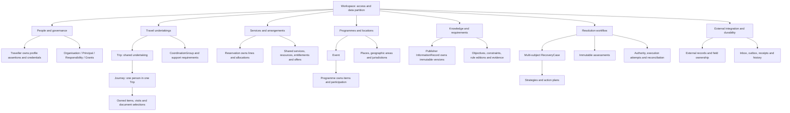
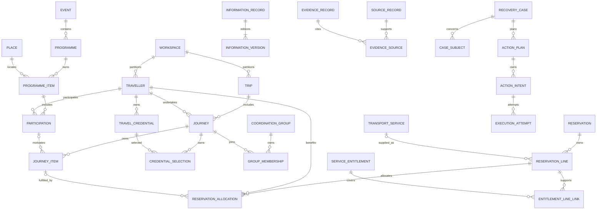

# Northstar: approved architecture closure

Status: **APPROVED TARGET — NOT IMPLEMENTED**. Decision: **GO / PARTIAL REFACTOR**.

Approved on 2026-09-13. Implementation baseline: repository
`dropandresetmain-prog/qoder-atlas`, main commit
`8b03934dadee20ec7ec271a45c5769de676dc3e7`.

This document records the final architecture-closure decision, including the
revisions to the earlier partial-refactor recommendation. It is normative for the
new data architecture. It does not claim that the target is current runtime
behaviour. The approval to record and push this documentation is not an instruction
to execute the implementation or perform production cutover.

Read with:

- [Logical persistence schema](DATA_STRUCTURE_LOGICAL_SCHEMA.md).
- [Complete implementation plan](IMPLEMENTATION_PLAN.md).

Existing README, architecture, capabilities, roadmap and workflow documents have
intentionally not been reconciled in this documentation change, as requested by the
owner. In particular, their SQLite default describes the previous architecture;
the explicitly approved target here is PostgreSQL. Code remains the evidence for
implemented behaviour. Future implementation must report real contradictions,
without treating old aggregate shapes as a reason to abandon these decisions.

## 1. Recommendation and frozen decisions

Preserve the generalized recovery loop and useful deterministic algorithms. Replace
the ownership, aggregate, persistence, shared-state and execution contracts that
prevent that loop from operating correctly across people and independently changing
objects. This is a partial refactor of the product, but a substantial replacement of
its data foundation. Changing only the database is insufficient.

| ID | Frozen decision |
|---|---|
| F01 | Modular monolith. Domain commands and deterministic evaluation are independent of database, UI, connectors and workers. No microservice split is required. |
| F02 | PostgreSQL is the authoritative store, with PostGIS for geographic applicability. No graph database, general event-sourcing platform or external broker is required. |
| F03 | Workspace is the data/access partition. Organisation is a business party. Neither Organisation nor Traveller is an authenticated principal or an automatic execution grant. |
| F04 | Traveller is a stable person. Trip is a shared undertaking. Journey is the independently changing itinerary and intentions of exactly one Traveller within exactly one Trip. |
| F05 | Membership, human relationships, operational accompaniment, booking allocations, organisational responsibility and authority are distinct concepts. |
| F06 | Intended, required, externally observed, internally authoritative, proposed and computed state have distinct owners and mutation paths. |
| F07 | Event has Programmes; Programme owns mutable ProgrammeItems and participation/scheduling associations. Recovery may genuinely change an internally controlled programme. |
| F08 | External records have explicit identity, observation history, ownership bindings and servicing capabilities. Observing a record never implies permission to modify it. |
| F09 | External information is versioned by publisher/publication lineage, with evidence, applicability, authority and freshness. No universal authority ladder chooses a single world truth. |
| F10 | Entry feasibility is a derived determination over a particular person's route, document selections, history, purpose and applicable external requirements. It is not a Traveller boolean. |
| F11 | Ordinary relationships use typed references/FKs. Only registered dependency semantics execute. Broad information uses applicability matching, not millions of canonical synthetic edges. |
| F12 | Assessments are immutable results with aggregate revisions, scope generations, evidence and coverage references, evaluator versions and time invalidation. |
| F13 | Hypothetical strategies use isolated multi-object scenarios. They cannot rewrite their judging rules or fabricate supplier confirmation, credentials or external facts. |
| F14 | Typed actions pass deterministic viability and scoped authority before durable execution, observation and reconciliation. AI cannot directly invoke consequential actions. |
| F15 | Commands use expected revisions, idempotency receipts, audit and transactional outbox. External calls occur outside database transactions. |
| F16 | New information categories enter through typed, additive domain/schema/evaluator extensions. Arbitrary JSON facts are not a substitute for domain ownership. |
| F17 | Cutover uses a controlled write freeze, transformation and reconciliation. Routine dual-write between old and new models is not required. |
| F18 | Preserve genuine obligations, personal edits, provider references, evidence and uncertain executions. Recompute derived state; reseed only verified fixture data. |

Names of individual implementation files and SQL columns may be settled in M0.
Ownership, cardinalities, semantics, safety boundaries and the logical schema below
are frozen. M0 materializes these contracts; it is not another foundational design
pass. A substantive change requires a documented contradiction and an explicit
architecture decision, not an adapter-local workaround.

## 2. Current architecture reconstructed from implementation

### 2.1 Current model and ownership

| Object/category | What it represents today | Properties, relationships and ownership |
|---|---|---|
| Organisation | Party with descriptive operating/paying/approval roles | Identity, role descriptions and optional home currency. Role labels alone do not form a complete grant model. |
| Traveller | Person/profile | Name, home context, arrangement declaration, nationality/passport facts, accessibility and insurance references. Passports are shallow context, not full credentials. |
| AnchorEvent | Shared event context | Owns embedded AnchorCommitments with time/place/source facts. Trips reference one AnchorEvent. |
| AnchorCommitment | Programme obligation | Stable ID inside AnchorEvent; title, kind, location, start/end facts. No complete independent cancellation/revision lifecycle. |
| Trip | Main domain aggregate | One or more traveller IDs, one optional anchor event, embedded elements/objectives/relations, policies, version and persisted viability. Runtime intake generally creates one-person Trips. |
| TripElement | Travel/activity plus fulfilment and health | TRANSPORT_LEG, STAY or ENGAGEMENT. Common reservation state, status, importance/flexibility, dependencies and rule references. A transport element mixes desired movement, observed service and booking details. |
| Engagement | Activity on a Trip | May reference an AnchorCommitment but also copies its time and place. These copies can disagree with the shared commitment. |
| Objective | Desired Trip outcome | Target element links, importance/hardness and status. Status includes both actual disposition and assessment-like values. |
| TripRelation | Named relationship | CONNECTS_TO, DEPENDS_ON, REQUIRES and SHARES_RESOURCE_WITH exist in contracts; not all have implemented propagation semantics. `dependsOn` also exists on elements. |
| RuleSet / Constraint | Policy/check definition | Sourced rules and parameters. Constraint definitions also carry PASS/FAIL/UNKNOWN, mixing requirements with evaluation results. |
| Fact / SourceRecord | Provenance wrapper and captured material | Fact carries value/source/observation/verification/expiry plus an authority category. SourceRecord/raw content is separate. Context is not consistently revisioned with a Trip. |
| RecoveryCase | Single-Trip recovery workflow aggregate | One tripId with nested strategies, authority decisions, intents, results, resolution and a broad approval envelope. |
| Snapshot / overlay | Evaluation and hypothetical state | Snapshot centers on one Trip and its version. Overlay isolation is useful but cannot represent complete shared-state consequences reliably. |
| ChangeRequest / signal | Desired change / normalized event | Desired changes are appropriately distinguishable from observation, but requests lack a complete independent persistence lifecycle. |
| Booking dossier / preferences / inbox | Operational supporting state | Separate stores; dossier duplicates personal booking identity, inbox deduplicates receipt without a complete resumable processing protocol. |

Implementation evidence at the baseline:

- `src/domain/common.ts`, `entities.ts`, `elements.ts`, `trip.ts`,
  `constraints.ts` and `rules.ts` define the shapes above. `PassportContext` in
  `entities.ts` supplies issuer country and expiry rather than the entry model
  required by the next product.
- `src/operational/snapshot.ts` and `src/engine/overlay.ts` center evaluation on
  one Trip. Shared objects are not covered by a complete revision manifest.
- `src/app/programme.ts` already performs real shared commitment mutation and
  sequential fan-out to related Trips. Programme mutation is therefore not wholly
  absent. However, shared commitments remain embedded; cancellation and copied
  engagements do not share one complete authoritative lifecycle.
- `src/app/signalPipeline.ts` applies commitment cancellation to individual
  engagement reservation state. `src/app/eventChangePreview.ts` uses a separate
  six-hour heuristic rather than the same viability engine.
- `src/engine/impact.ts` implements connection/objective consequences but returns
  an empty shared-resource impact set. The declared relation vocabulary must not
  be described as an implemented general graph engine.
- `src/engine/evaluators.ts` returns UNKNOWN for ENTRY. The entry research query in
  `src/contracts/capabilities.ts` is essentially destination, nationality and date;
  it cannot support the required document/transit/history evaluation.
- `src/app/recoveryExecution.ts` derives consequential operations from generic
  element upserts, supports a narrow confirmed-operation set, and reuses a
  case-level approval envelope. A provider-confirmation guard exists, but promoting
  candidate fields to authoritative state remains too broad for the target.
- `src/engine/observation.ts` checks unresolved overnight requirements differently
  for FULLY_RECOVERED and RECOVERED_WITH_LOSS. Accepted loss must not exempt unrelated
  mandatory requirements in the new model.

### 2.2 Current lifecycle and storage

The useful RecoveryCase phases are DETECTED, ASSESSING, PLANNING,
READY_TO_EXECUTE, AWAITING_TRAVELLER, AWAITING_APPROVAL, EXECUTING, VERIFYING,
ESCALATED and RESOLVED. Resolution distinguishes FULLY_RECOVERED,
RECOVERED_WITH_LOSS and ESCALATED_CLOSED. Intent state distinguishes proposal,
authorization, rejection/supersession, execution and failure. Preserve the useful
business distinctions, while replacing broad approval and execution persistence.

The SQLite base schema in `src/persistence/database.ts` contains `schema_meta`,
`trips`, `cases`, `signals`, `sources`, `source_contents`, `entities` and `audit`.
Rich state is serialized as JSON with no relational FKs between the domain objects.
App stores add `preferences`, `booking_dossiers`, `fx_rates` and
`provider_event_inbox`. Schema setup is CREATE IF NOT EXISTS plus schema-version
assignment, not an ordered migration history. WAL and BEGIN IMMEDIATE are present.

`src/engine/mutation.ts` loads/clones Trips before the write transaction and writes
direct SQL upserts. Only affected Trip versions advance. Repositories reject lower
versions but equal-version overwrites remain possible: that is not compare-and-swap.
Snapshots can combine separately awaited reads. `src/app/eventIngest.ts` treats
previously received inbox events as duplicates even if processing did not finish.
Execution writes, external calls and subsequent result/audit writes do not form a
complete durable uncertain-outcome protocol.

The inspected restart tests demonstrate orderly close/reopen, not crash recovery or
safe concurrent workers. The user's reported SQLite operational problems are real
motivation to investigate deployment history, but the code review does not prove
database corruption, a particular lock incident or a missing hosted volume. Do not
claim PostgreSQL alone repairs the application-level races.

### 2.3 Structural critique and disposition

| Problem | Why it matters | Decision |
|---|---|---|
| Trip combines people, itinerary, booking and computed health | Independent people and shared services cannot mutate cleanly | Split Trip/Journey/Reservation/Service; preserve recovery concepts. |
| Commitment and engagement duplicate programme schedule | Changes can leave contradictory truth | ProgrammeItem owns schedule; participation references it; projections carry revision. |
| Profiles and dossiers duplicate identity | Updates, document selection and privacy become ambiguous | Traveller credentials/assertions own identity; dossier becomes provider DTO. |
| Relations, implicit links and dependsOn overlap | A graph label can promise unsupported behaviour | Concrete references plus two explicit executable dependency families. |
| Definitions persist assessment status | Cached conclusions feed later conclusions | Immutable assessment records; current health is a projection. |
| Generic upsert-based recovery | A proposed supplier field can masquerade as executed truth | Typed scenario changes and typed domain/external actions. |
| Single-Trip case and snapshot | Shared programme/group recovery is incomplete | Multi-object closure, revision manifest and multi-subject case. |
| Case-wide approval | Approval can cover actions the approver did not inspect | Exact plan/action scope, limits, actors and revision-sensitive validation. |
| Blob upserts and weak version checks | Lost updates, unqueryable relationships and unsafe concurrency | Relational ownership, expected revisions and invariant transactions. |
| Receipt-only inbox and incomplete attempts | Crashes can lose work or duplicate money-moving calls | Durable inbox work, attempts, uncertain outcomes and observation. |

All are **Act Now** in their assigned implementation milestone. Deferring them would
retain the foundational ambiguity this refactor is intended to remove. Good time,
buffer, cost-comparison, preference and recovery-state abstractions remain useful.

## 3. Final hierarchy



Containment in this diagram is conceptual unless the ownership table below explicitly
makes an object an owned child. A Workspace is not one transaction aggregate.
Cross-workspace visibility is an authorization feature, never an accidental FK.
The initial schema keeps domain rows in a Workspace; future sharing requires an
explicit import/federation boundary with provenance and permissions.

## 4. Canonical ontology and aggregate ownership

Every mutable root has a revision. Every addressable child has stable identity and
uses its root's revision. Canonical children cannot change through a repository
that bypasses that root. Historical versions and assessments are immutable.

### 4.1 People and governance

| Object | Purpose and key properties | Owner / relationships | State and permitted mutations |
|---|---|---|---|
| Workspace | Security/data partition, operational configuration | Root; contains independently governed aggregates | Administrative lifecycle. Administration cannot confer business action authority implicitly. |
| Organisation | Company, agency, organiser or other business party; identity and accounting currency | Root in Workspace; roles through assignments | Party administration changes identity/configuration, not supplier records. |
| Principal | Authenticated human/service actor | Root; memberships link organisations and capabilities | Identity/access administration. A person profile alone is not a Principal. |
| Traveller | Stable person identity, names and contact channels | Root; many Journeys and credentials | Profile commands or accepted source observations; merge only with verified identity mapping. Never derive ID from event/intake row. |
| ProfileAssertion | Citizenship, residency, access/support need and other typed personal facts; effective period and evidence | Traveller-owned child | Append/correct assertions through profile commands; preserve historical evidence and conflict. No unsourced global replacement. |
| TravelCredential | Passport, visa/e-authorisation, residence or health credential; issuer, protected identifier, issue/validity dates, restrictions | Traveller-owned, addressable child; version history and links to other credentials | Accepted observations/verified profile commands. Issuer status and physical availability are separate. Expiry is computed for the intended dates. |
| TravellerRelationship | Sourced human relationship, such as parent/guardian, with effective dates | Independent root referencing two Travellers | Relationship commands/accepted evidence. Does not itself define route support or grant spending/consent powers. |
| ResponsibilityAssignment | Operator, arranger, servicer, payer, duty-of-care responsibility within a scope | Independent association linking Organisation to Trip/Journey/reservation or other supported subject | Scoped assignment commands; historical effective periods. Responsibility is not authority. |
| AuthorityGrant | Who may do which actions for which party, subjects and limits; issuer/evidence/effective dates | Independent root linking Principal, represented party and typed scopes | Grant/revoke commands by authorized issuer. Expiry derived. No implicit grants from job title, relationship or booking import. |

Credential numbers and raw documents require protected storage, access policy,
redaction and explicit disclosure to a provider. Provider dossiers contain the
minimum permitted projection, with source revisions, rather than a second editable
personal record. Travel history is sourced evidence attached to the person; it is
not inferred complete merely because Northstar holds some past Journeys.

### 4.2 Travel undertakings and coordination

| Object | Purpose and key properties | Owner / relationships | State and permitted mutations |
|---|---|---|---|
| Trip | Shared undertaking: purpose, window, business context, collective objectives | Root; 0+ Journeys in draft, 1+ while active | Draft/active/completed/cancelled via Trip commands. No universal Trip itinerary or averaged eligibility. |
| Journey | One person's intentions/itinerary within a Trip; own windows and responsibility | Root; exactly one Traveller and Trip; unique Trip+Traveller | Draft/active/completed/cancelled. Authorized intent changes; independent from another member's route. |
| JourneyItem | Intended movement, stay, engagement or resource use; ordering/windows/flexibility | Journey-owned typed child: TRANSPORT, STAY, ENGAGEMENT, RESOURCE_USE | Planned/active/completed/dropped. References fulfilment; does not own supplier schedule/status. Engagement references Participation OR an owned standalone appointment, never both. |
| IntendedVisit | Intended jurisdiction, purpose, date range and transit/entry intention | Journey-owned child | Traveller/arranger instruction changes; distinguish intention from projected border encounters. Actual crossings require sourced observations. |
| CredentialUseSelection | Exact documents to use for a scoped route/encounter | Journey-owned child linking the same Traveller's credentials | Explicit selection/approved strategy command; versioned and evaluated as a consistent set. |
| CoordinationGroup | Named operational subset of Journeys, possibly across Trips | Root; memberships reference Journeys and effective interval/items | Create/change/close coordination scope. Optional: do not create a second group for every Trip automatically. |
| SupportAssignment | Selected supporters and their assigned intervals/handoffs for an accompaniment requirement | Versioned aggregate/association referencing the governing ConstraintDefinition and affected Journeys/people | Authorized assignment command within the unchanged requirement. ConstraintDefinition owns required coverage, eligible alternatives, minimum count and separation conditions; satisfaction is computed. |

Solo travel is a Trip with one Journey. A couple or family may share one Trip with
one Journey each. Colleagues may share a reservation while belonging to different
Trips. A delegation or tour can use a Trip and optional coordination subgroups;
membership alone does not demand identical routes. Splitting routes midway changes
JourneyItems and allocations, not identity or the meaning of Trip.

The accompaniment ConstraintDefinition owns mandatory coverage and supporter
eligibility. SupportAssignment owns selected fulfilment. A strategy may choose a
different eligible supporter or permitted handoff, but cannot relax the requirement
to make itself viable. Relationship evidence informs both without becoming either
an assignment or a grant.

For a dependant, represent continuous support coverage through relevant travel,
transfer and stay intervals. Permit alternative eligible adults and explicit
handoffs where appropriate. An assistant's assignment is operational support, not
necessarily legal guardianship. Peers travelling together use a travel-together
constraint, not fabricated guardian relationships. A guardian's legal relationship
is evidence for an authority policy, not blanket permission to spend or change all
records.

### 4.3 Services, bookings and commercial context

| Object | Purpose and key properties | Owner / relationships | State and permitted mutations |
|---|---|---|---|
| TransportService | Shared occurrence of transport; mode, endpoints, published/estimated/actual times | Independent root; many JourneyItems/reservation lines may reference | Accepted supplier/operator observations own service facts. A traveller request does not retime the flight. |
| Resource | Vehicle, room or other usable asset/capacity; type, location and operating properties | Independent root, typed detail | Internal resource commands or designated external observations per ownership binding. |
| Reservation | Supplier booking/order with business parties, external identity and servicing context | Root; owns lines and allocations | Observed lifecycle. Internal requested changes live in actions. Booking ownership is not the first importing Journey. |
| ReservationLine | Booked product and observed terms/status; service/resource or stay interval | Reservation-owned typed child | Accepted provider observation. Group confirmation can coexist with line-level differences. |
| ReservationAllocation | Which Traveller benefits from a line, optionally satisfying a JourneyItem | Reservation-owned association | Observed/authorized allocation commands according to ownership. Linked item must belong to that person. Imported bookings may precede itinerary assignment. |
| ServiceEntitlement | Ticket/coupon/voucher or other right to consume service; components and exchange lineage | Independent observed root linked to reservation lines/people | Issuer observations. Confirmation is not issuance; exchange preserves old entitlement history. |
| Offer | Quoted services, exact price/currency/terms, eligibility, source account and expiry | Immutable quote record with line references | Capture a new quote; never edit an old quote into a booking. Expiry/current availability derived. |
| CommercialAgreement | Negotiated/private eligibility and contractual context | Versioned root linked to organisations/accounts/scopes | Authorized contract edition publication. Connector interprets provider codes without leaking them into core policy. |
| AccountingDimension / CostAllocation | Cost centre/project and intended/actual financial allocation | Org-owned dimension; scoped allocation associations | Authorized accounting assignment. Actual financial evidence remains traceable. |
| BudgetCommitment | Concurrent hold against a budget for authorized execution | Financial aggregate records exact currency/amount, action and hold/release/settlement entries | Deterministic transaction. Unknown external outcome retains the appropriate hold; this is not a full general ledger. |

Different reservation lines can serve different subsets of a group. A shared hotel
reservation does not mean every traveller shares a room or all stay dates. A car
rental is resource use, not a fake scheduled transport leg. A booking may be observed
read-only, serviced through an agency, or directly controlled; the connector's
capability and scoped grant decide which action is possible. GDS/NDC/direct system
origin is external identity and capability context, not competing core ontologies.

### 4.4 Programmes and geography

| Object | Purpose and key properties | Owner / relationships | State and permitted mutations |
|---|---|---|---|
| Event | Overall event identity, organiser and context | Root; zero or more Programmes | Draft/active/completed/cancelled via authorized commands or designated source. |
| Programme | Coherent mutable schedule and scheduling rules | Root belonging to Event; owns items, participations and scheduling associations | Draft/active/completed/cancelled. All schedule/participation changes advance its revision. |
| ProgrammeItem | Actual scheduled activity: title/type, start/end/timezone, place, operating requirements | Programme-owned child with stable ID | Draft/scheduled/completed/cancelled. Reschedule/relocate are changes; cancellation is canonical, reinstatement explicit. |
| Participation | Person's relationship to an item: roles, obligation, preparation/release windows | Programme-owned association; unique item+Traveller; multiple roles permitted | Assignment/acceptance and attendance are separate dimensions. No Journey required for local participants. |
| ResourceAssignment | Resource/capacity assigned to an activity | Association owned by scheduling aggregate; resource FK | Allocation commands under capacity checks; references activity schedule rather than copying it as truth. |
| Place | Operational location, timezone, coordinates and external references | Shared root | Validated location commands/observations. |
| GeographicArea | Spatial footprint and effective geometry versions | Shared versioned root; memberships are dated | Geographic dataset updates with provenance. |
| Jurisdiction | Legal/entry regime and effective geographic applicability | Shared root; many-to-many dated area links | Accepted regime/reference updates. Not synonymous with country code or an airport. |

ProgrammeItem time is genuine domain state. Moving a keynote from morning to
afternoon can help one person and invalidate another's route, venue availability,
staffing or dependent session. The candidate must evaluate that complete closure.
On authorized internal execution, a programme command is authoritative immediately
upon its successful transaction. If an external event system owns the schedule,
the action remains requested until accepted external observation confirms it.
Engagement UI times are projections of participation/item state, stamped with the
owning revision. They are never independently edited schedule truth.

### 4.5 Objectives, requirements and knowledge

| Object | Purpose and key properties | Owner / relationships | State and permitted mutations |
|---|---|---|---|
| Objective | Desired outcome, typed success predicate, hardness/priority and targets | Owned by Trip, Journey, CoordinationGroup or Programme | ACTIVE/ACHIEVED/WAIVED/CLOSED_WITH_LOSS disposition; authorized commands only. Threatened/impossible is assessment. Reprioritization is a change, not lifecycle state. |
| ConstraintDefinition | Typed requirement, operands, hardness, provenance and scope | Explicit owning requirement aggregate; may be a child of a rule/objective owner | Requirement commands/publication. No PASS/FAIL/UNKNOWN field. Accompaniment/capacity/travel-together use registered evaluators. |
| RuleSet / RuleSetVersion | Coherent policy or external requirement with immutable published editions | RuleSet root owns editions; assignments define applicability | Draft/published/superseded/withdrawn editions; effective dates separate. Published rule expressions cannot be edited by scenario. |
| RuleAssignment | Applies an exact policy family/edition selection rule to organisation/population/subject/time | Versioned scoped association | Authorized assignment commands; insertion invalidates matching assessments. |
| Preference | Sourced explicit or inferred preference with scope/precedence | Traveller-owned or explicit scoped assignment | Explicit instruction commands; inference remains soft and cannot override explicit instructions. |
| SourceRecord | Immutable captured material, content hash and protected raw reference | Independent immutable record | Ingestion only; retention/access administration must retain required audit metadata. |
| EvidenceRecord | Immutable normalized assertion/observation with subject, times, schema and interpretation provenance | Independent immutable record linked to sources and subjects | Validated normalization creates new evidence; correction never silently rewrites history. |
| InformationRecord | A publisher's continuing publication identity | Root; owns immutable InformationVersions | Accept editions/corrections/retractions with source sequencing and provenance. |
| InformationVersion | Advisory, condition or regulatory publication with applicability/time/source-native meaning | Immutable child; regulatory edition references exact external RuleSetVersion | Version acceptance; current selection is effective-time and lineage aware, not simply newest receipt. |
| KnowledgeCoverage | What a query/feed edition actually covered, its completeness limits and watermark | Immutable evidence plus revisioned source-sync state | Connector/evidence commands. An empty result is not proof of safety without supported coverage. |

### 4.6 Resolution and integration objects

| Object | Purpose and key properties | Owner / relationships | State and permitted mutations |
|---|---|---|---|
| ChangeRequest | Desired change, requester, targets and constraints | Root referencing subject scopes | Submitted/accepted for planning/withdrawn/closed; acceptance is not supplier success. |
| ChangeSignal | Immutable causal notification with subjects/applicability and evidence | Immutable record | Validated ingestion or domain command emits it. It is not the current world state. |
| RecoveryCase | Recovery coordination for affected people/objects and losses | Root with many subject/signal links | Existing useful phase machine retained; case commands derived from current assessment/action evidence. |
| RecoveryStrategy | Versioned candidate scenario and explanation | Case-owned immutable candidate versions | Proposed/evaluated/selected/rejected/superseded; editing creates new version. |
| Assessment | Impact, viability, entry, support, risk or policy result | Immutable computed record | Deterministic evaluator only; includes complete input manifest, reasons and expiration. |
| ActionPlan / ActionIntent | Typed effects, ordering, scopes, expected observations, limits, failure/compensation behaviour | Case-owned plan and intent records; shared action owned once | Proposal/authorization/execution transitions under deterministic commands. No arbitrary aggregate replacement. |
| AuthorityDecision / ApprovalRequirement / Approval | Policy decision and the independent actors/scopes that must assent | Immutable decisions/approval statements linked to exact plan/action version | Authority evaluation and authenticated approval commands; revocation explicit; approval freshness derived. |
| ExecutionAttempt | Durable per-dispatch sequence, claim, outcome and observation | Action-owned attempt record; logical operation key/fingerprint belongs to ActionIntent and is reused across its attempts | Worker state machine with reconciliation; uncertainty survives process failure. |
| ExternalConnection / ExternalRecord | Connected account and provider record identity | Independent roots; unique connection+type+external ID | Connector administration/observations. Same locator from different systems is not automatic identity equality. |
| OwnershipBinding | Who owns a subject's particular field group | Versioned association, at most one explicitly current binding per field group | Controlled transfer with reconciliation/audit. Future proposals never activate by time alone; missing/expired owner does not default to internal ownership. |
| InboxDelivery / InboxWork / Outbox | Received event, per-target resumable work and committed publication | Infrastructure records | Claimed/retried/finished transactionally, with durable deduplication. |
| CommandReceipt / ChangeRecord | Idempotency outcome and before/after audit linkage | Immutable records | Written with successful domain transaction. History supports audit, not mandatory event-sourced reconstruction. |

## 5. Cardinalities and relationship semantics



The ERD omits some association/detail tables for readability; the logical schema
defines them. Optional cardinality on a typed association does not authorize a
wrong-type reference. Active Trip membership, engagement choice, document/person
consistency and publication invariants are enforced by commands and database
constraints where appropriate.

Use FKs for ownership, membership, allocations, participation, policy assignments,
source links, place references and provider identities. Do not duplicate those as
independently editable TripRelations.

Two explicit dependency families are frozen:

1. **CONNECTS_TO**: upstream to downstream operational connection. Evaluate time,
   locations, transfer/buffer conditions and evidence. Upstream change prompts
   reevaluation; it does not automatically invalidate everything downstream.
2. **REQUIRES**: dependent to prerequisite with a registered typed predicate. The
   relation is executable only because an evaluator defines what satisfaction means.

Retire duplicate `dependsOn` and generic `DEPENDS_ON` representations. Shared
resource, travel-together, co-presence, capacity and accompaniment semantics are
typed constraints/associations, not an unexplained SHARES_RESOURCE_WITH traversal.
Dependency closure follows reverse references, explicit dependencies and
applicability matches. Cycles in discovery use a visited set; the execution action
DAG must be acyclic. Evaluators must not recursively compute an undefined fixed
point from each other's cached health values.

Cross-Trip propagation uses the same references: shared reservation allocations,
programme participation and coordination/support scopes. Geography-wide information
first selects a conservative candidate set by space/time/population, then performs
deterministic applicability checks. It does not persist an authoritative edge for
each alert-to-traveller match. Derived exposure indexes are revisioned accelerators.
Unknown location/coverage expands or marks uncertainty; it cannot establish that a
person is unaffected.

## 6. Canonical state, mutation ownership and freshness

| Value | Canonical owner and writer | Permitted copies / derived state |
|---|---|---|
| Intended travel windows, route/purpose | Journey and its children; authorized instruction command | Read projections include Journey revision. |
| Published/estimated/actual service times | TransportService field groups; accepted owner observations | Effective itinerary selects applicable observation explicitly; do not overwrite published with estimate. |
| Programme schedule/status | ProgrammeItem under Programme revision; internal command or designated external owner | Engagement/UI projection references item and revision; no editable copy. |
| Reservation/line supplier state | Reservation via accepted provider observation | Requested actions and hypothetical scenarios separate. Confirmation and ticket issuance separate. |
| Traveller documents/requirements | Traveller credentials/assertions; sourced profile commands | Provider DTO protected projection. Entry validity is evaluated, not stored as profile status. |
| Human relationships and group membership | Relationship and group/Trip membership owners | Support satisfaction and authority are separate computations. |
| Objectives and rules | Respective owner and immutable published editions | Threat/viability results point to exact versions; proposals cannot change judges. |
| Advisory/condition current knowledge | Each publisher's InformationRecord editions | Organisation-specific risk/response is assessment over editions and coverage. |
| Entry eligibility | No editable current eligibility object | Immutable EntryAssessment scoped to person/route/docs/date/rules; current view resolves freshness. |
| Approval and authority | Grants, rule editions and immutable scoped approvals | Readiness is derived; no copied case-wide boolean is authoritative. |
| Recovery phase | RecoveryCase transition commands | Progress projections reference case/action/assessment revisions. |
| Viability/health | Immutable assessment results | UI cache is explicitly non-authoritative and includes current/stale/pending and reasons. |

Each assessment manifest contains:

```text
evaluatedAt
evaluatorVersions: { evaluatorId, version }[]
aggregateReads: { aggregateId, revision }[]
scopeReads: { scopeKind, scopeId, generation }[]
evidenceReads: immutable evidence/version IDs[]
coverageReads: query/feed bounds, editions, watermark and limitations[]
nextInvalidationAt
```

Checking read objects alone misses inserted rules, new group members and newly
published hazards. Commands therefore increment affected scope generations in the
same transaction: Journey/Trip membership, Programme, Traveller documents,
coordination, Organisation rules/grants and information/geography catalogs. Initially
use conservative Workspace/topic generations where a narrower information scope
cannot be proven complete. New/unclassified information must not evade invalidation.

Time alone can stale an assessment: quote expiry, passport validity threshold,
forecast interval, rule effective date or grant expiry. Persist scheduled
reassessment work and catch up after downtime. At selection and execution claim,
validate manifest, current clock, ownership and authority. A changed input triggers
reevaluation. Approval can be reused only if the refreshed result still falls
within its exact signed/recorded envelope; never silently widen the envelope.

## 7. Travel advisories and external conditions

Separate four things: what a source says; the condition it describes; what an
organisation requires in response; and the consequences for particular people and
activities. No single mutable `Trip.riskStatus` can own all four.

An advisory is a typed InformationVersion with issuing source, publication lineage,
source-native level and meanings, affected risks, geography/population, effective
interval, evidence and supersession/retraction links. A rapidly emerging report
can also describe a condition without pretending to be an official advisory.
Keep conflicting publishers' claims. Authority is assessed for topic, issuer,
jurisdiction, ownership and time; a confidence score cannot promote a report into a
government statement.

Preserve issuedAt, observedAt, receivedAt, effective interval, provider sequencing,
forecast target where relevant and supersedes/retracts identity. Receipt time does
not make an old statement fresh. A future-effective edition does not replace the
currently effective rules early. A connector cannot claim complete coverage unless
the upstream contract supports it.

Organisation policies can react differently to the same claims: mandatory avoidance,
human review, monitoring, precautionary routing or no action. Policy thresholds are
explicit sourced requirements, not destructive rewriting of source-native levels.
A fast, lower-authority hazard report may trigger review or a hold under policy;
it must not automatically become an authoritative flight cancellation.

Propagation is publication acceptance -> information/scope revision -> matching
active exposure -> deterministic applicability -> risk/policy/viability assessments
-> recovery when an objective or requirement is affected. Recovery may request
verification, change route/dates/activity, move a programme item or escalate.
UNKNOWN and conflicting information remain visible. Operational, legal entry,
support, programme and organisational policy verdicts remain distinct dimensions.

## 8. Passport, visa, entry and transit architecture

Entry feasibility depends on the person, the exact itinerary and the time of use.
It cannot be reduced to nationality plus destination, or a passport-valid boolean.

Canonical inputs include citizenship/residency assertions; passports and linked
visas/e-authorisations; issue/expiry and issuer status; document availability;
purpose/duration and intended visits; selected documents; sourced travel history
where cumulative stay or usage limits apply; and published external requirement
editions with applicability and coverage. Missing travel history is UNKNOWN, not
zero previous days. Visa-to-passport links and consistent document selection prevent
an evaluator from cherry-picking incompatible passports at separate encounters.

Derive border/entry/transit encounters from effective JourneyItems, service points,
jurisdiction membership and relevant operational evidence: terminal change,
airside access, baggage recheck, onward entitlement, overnight arrangements and
permitted transfer. A connecting airport code alone cannot prove airside transit.
Route changes regenerate encounters and invalidate prior entry assessments.

External regulatory InformationVersions reference exact immutable RuleSetVersions.
Metadata/provenance lives in the publication; executable obligations/exemptions live
in the rules. Use a bounded typed predicate language with registered operators and
`all`/`any` composition, explicit applicability and supported negation semantics.
No `eval`, arbitrary script or unreviewed AI-produced executable rule. Evaluate
PASS/FAIL/UNKNOWN with reasons and evidence, including alternative exemptions,
document validity at travel dates, purpose/duration and required health/documents.
Incomplete, stale or conflicting requirements cannot become PASS merely because
no prohibition was retrieved.

An EntryAssessment references Traveller/Journey revisions, derived encounters,
selected credential versions, history evidence, rule editions and coverage. A new
or future-effective government requirement invalidates all matching active Journeys
even if their bookings did not change. Organisation approval cannot waive legal
requirements. Legal compliance and corporate policy remain separate verdicts.

Recovery may collect missing facts, refresh sources, choose a supported document
set, change route/dates, or plan document procurement. A future visa application is
not an issued visa in the current world. A proposed travel purpose must reflect a
real authorized intention, not an invented label to satisfy an evaluator.

The legal data provider, licensed coverage, interpretation verification and
freshness service levels are external facts still to establish. The schema and
evaluator/coverage boundary are frozen; unsupported real requirements return
UNKNOWN or a blocked consequential action rather than forcing schema redesign.

## 9. Lifecycle rules

| Object | Explicit lifecycle/dimensions | Derived or event-only distinctions |
|---|---|---|
| Trip / Journey | Draft, active, completed, cancelled | Feasible, at risk and recovered are assessments, not membership lifecycle. |
| JourneyItem | Planned, active, completed, dropped | Reservation status and service disruption belong elsewhere. |
| Event / Programme | Draft, active, completed, cancelled | Date change is a command/event. |
| ProgrammeItem | Draft, scheduled, completed, cancelled | Reschedule/relocate are changes; reinstatement explicit. |
| Participation | Assignment/acceptance dimension; attendance dimension | Ability to attend is computed. |
| ReservationLine | Observed held, confirmed, cancelled, fulfilled or unknown, retaining provider-native detail | Pending modification belongs to action; CHANGED is history. |
| Entitlement | Observed issued/active, used, exchanged, void/revoked | Expiry is computed; confirmed reservation is not issuance. |
| Credential | Issuer status and possession/availability separately | Validity/eligibility at a date is computed. Application workflow is separate. |
| Relationship / grant | Effective interval and revocation | Expired is a time projection. |
| Objective | ACTIVE, ACHIEVED, WAIVED, CLOSED_WITH_LOSS | Threatened/impossible are assessment; priority changes are events. |
| Rule edition | Draft, published, superseded, withdrawn | Effective applicability and freshness are computed. |
| Information edition | Issued, corrected, superseded, retracted lineage | Stale is computed; keep history immutable. |
| Strategy | Proposed, evaluated, selected, rejected, superseded | Evaluation currency is manifest-dependent. |
| Intent | Proposed, authorized, rejected, superseded, executing, completed, failed | Unknown provider outcome belongs to durable attempt, not assumed failure. |
| Attempt | Prepared, dispatched, outcome_unknown, observed_success, observed_failure, reconciled | Timeout alone cannot prove failure. |
| Inbox work | Received, processing, retry_wait, done, dead_letter | Duplicate delivery is an event; unfinished work remains runnable. |
| Assessment | Immutable result | Current/stale/pending is calculated against dependencies and time. |

Retain RecoveryCase transitions:

```text
DETECTED -> ASSESSING
ASSESSING -> PLANNING | ESCALATED | RESOLVED
PLANNING -> READY_TO_EXECUTE | AWAITING_TRAVELLER | AWAITING_APPROVAL | ESCALATED | RESOLVED
READY_TO_EXECUTE -> EXECUTING | AWAITING_TRAVELLER | AWAITING_APPROVAL | PLANNING | RESOLVED
AWAITING_TRAVELLER / AWAITING_APPROVAL -> READY_TO_EXECUTE | PLANNING | ESCALATED | RESOLVED
EXECUTING -> VERIFYING | ESCALATED
VERIFYING -> RESOLVED | ASSESSING | PLANNING | EXECUTING
ESCALATED -> ASSESSING | RESOLVED
RESOLVED -> terminal
```

Transitions require guards, not just enum permission. Waiting phases summarize a
list of independent approval requirements; they do not restrict the model to one
approver. New disruption after a terminal case opens/links a new case. Recovered
with loss means specific authorized dispositions, not exemption from remaining
entry, support, overnight or other mandatory requirements.

## 10. Final recovery-engine boundary

```text
change -> authoritative owner update -> consequence closure -> recovery planning
       -> deterministic scenario viability -> scoped authority -> execution
       -> owner-specific observation -> reconciliation -> fresh assessment
```

The engine receives a consistent read-only world slice and manifest, not writable
Trip JSON. It builds effective itinerary views from intention, allocations,
services, participation and current accepted observations. Impact readers include
all affected people, shared objects, requirements and applicability scopes.

Pure time/interval and preference utility code can survive unchanged where tests
prove it has no legacy-shape dependency. Connection feasibility, overnight stays,
concentration, funding/FX comparison and objective logic retain their sound
algorithms but adapt inputs/outputs. Replace floating-point consequential money
with exact decimal/minor-unit arithmetic and explicit rounding. Do not promise
unchanged files for algorithms that currently read mixed cached status.

The existing overlay isolation, deterministic validators, UNKNOWN handling,
authority/executor separation, provider normalization and useful case phases are
preserved. The single-Trip snapshot, generic entity-upsert strategy, cached-health
feedback, case-wide approval and whole-aggregate persistence are replaced.

Candidates contain typed intended changes: select a service/offer, propose an
allocation, change an internally owned programme slot, alter an authorized intent,
or change a support assignment within permitted rules. Scenarios cannot retime a
supplier flight as fact, issue credentials, loosen legal rules, erase obligations
or mark their own actions observed. Explicit objective waiver/loss is a separately
authorized disposition that cannot waive legal requirements.

An ActionPlan is an acyclic graph of typed actions with subjects, expected revisions,
offer fingerprints, costs/limits, required authority, preconditions, observation
contract and failure/compensation behaviour. One action affecting several people is
owned once; other cases can reference it. Approval requirements may combine payer,
traveller/guardian, organisation, programme owner and servicing agency using explicit
AND/OR requirements. All necessary grants and approvals must hold before dispatch.

No transaction can make multiple independent suppliers atomic. If the first action
succeeds and the second fails, preserve the actual success, recompute remaining
feasibility and execute only separately permitted compensation. Check that partial
execution does not strand a dependant before offering a strategy as executable.
If safe ordering/reservation/compensation cannot be established, require a supported
manual path or reject the strategy; do not pretend database rollback undoes travel.

Execution claims revalidate revisions, scope generations, clock, ownership,
capabilities, grants, approvals and financial limits in a short transaction. The
external call follows commit. A timeout enters outcome_unknown and triggers lookup
or observation using the same operation identity before retry. Accepted observations
update only fields owned by that source, never all candidate fields wholesale.
Internal programme execution uses its committed command receipt as observation.

Case resolution requires current mandatory assessments, reconciled actions, specific
authorized losses and no material uncertain execution. Successful booking alone is
insufficient. Evidence-gathering can proceed while feasibility is UNKNOWN; that
does not permit a false recovered verdict or an unrelated unsafe purchase.

## 11. Corporate and agency extensibility

The model separates five questions: whose traveller/undertaking this is; who pays;
who owns the booking; who may service it; and which Principal may execute the
specific action. ResponsibilityAssignment, CostAllocation, Reservation external
identity, ownership/capability bindings and AuthorityGrant answer them separately.

Traveller profiles can be sourced from corporate HR, agency systems or personal
updates with field ownership/evidence. Policies are organisation-scoped published
rules. Cost centres and private fares are accounting dimensions and commercial
eligibility, not arbitrary Trip tags used as permission. A private offer remains
bound to the eligible account/organisation and expiry; sharing a Trip cannot make
it available to an ineligible person.

Multiple external systems can refer to one canonical reservation through verified
identity links. A locator alone is insufficient proof. Keep original system IDs,
provenance and observation sequence. Read-only or agency-serviced records remain
first-class even when Northstar has no direct execution capability. Unsupported
split/exchange operations are structured capability failures, not invented core
provider logic. New connectors implement the same commands/observations and do not
define another travel model.

## 12. Unprecedented-data extension protocol

For a new category, an engineer must answer these questions before coding:

1. Is this an externally observed claim, internally controlled object, intention,
   requirement, proposal or computed conclusion?
2. Does it need stable identity and independent lifecycle, or is it a typed detail
   of an existing object/evidence version?
3. Which aggregate owns mutable state, and which system owns each field group?
4. Which ordinary references, geography/time/population scopes and explicit
   dependency predicates connect it to existing objects?
5. What source-native meaning, provenance, authority, sequencing, freshness,
   uncertainty and coverage must be preserved?
6. Which commands accept changes, increment which revisions/generations and emit
   which signals? How do new matching objects invalidate previous assessments?
7. Which reader/applicability module produces the complete candidate closure?
8. Which deterministic evaluator adds meaning, reasons and manifest dependencies?
9. Is a new typed action/capability required, with authority and observation rules?
10. Which additive schema migration, contract versions and architecture acceptance
    examples prove the integration?

A new adapter alone suffices only if the same semantics already exist. A new
independently changing concept warrants a typed object. New consequence semantics
warrant an evaluator; new external actuation warrants a capability. Additive tables
and typed contracts are expected, not a foundational failure. Storing arbitrary
payloads may preserve evidence, but does not mean Northstar understands them.

| Example | Placement and ownership | Required extension, propagation and limits |
|---|---|---|
| Severe weather/forecast | Condition InformationVersions per publisher, spatial/temporal scope and forecast uncertainty | Weather detail schema/adapter if absent; activity/ground/service-condition evaluators as needed. Match exposed services, routes and outdoor programme items. Organisation rules determine response. Weather does not itself authoritatively cancel a flight. |
| Electric rental vehicle range and charger outage | Typed Resource properties for vehicle/charger; sourced charge/availability observations; resource-use JourneyItem | Add typed energy/charging detail and evaluator, geographic/route exposure, possibly charger reservation capability. Failure can change rental choice or route. No replacement of Trip/Journey/Case ownership. |
| Professional accreditation or venue access permit | Traveller credential subtype linked to issuer evidence; ProgrammeItem access requirement | Add credential detail, issuer adapter and access evaluator. Expiry/revocation affects participation and dependent Journeys. A proposed accreditation application is not current access entitlement. |

The promise is a clear extension method within a travel-resolution product, not
that every future business will require zero migrations. Do not introduce a general
graph interpreter, EAV fact store or arbitrary rule execution to avoid typed work.

## 13. Persistence decision and source references

PostgreSQL fits independent shared aggregates, relational integrity, multi-worker
concurrency, durable queues and production deployment. PostGIS supports correct
geographic applicability. SQLite remains useful for reading archived legacy data,
but is not the target authoritative runtime or a substitute for PostgreSQL test
coverage. MySQL is a credible relational alternative but offers no application
advantage that warrants a second design; PostgreSQL's constraints, transactions and
spatial ecosystem fit the approved needs. A document database preserves too much
cross-document ownership/integrity work in application code; a graph database does
not solve booking/approval transaction ownership. No additional database is needed.

The companion logical schema defines keys, ownership, immutable history, indexes,
JSON boundaries and transaction protocols. Correct transactions, idempotency and
observation remain application obligations regardless of the database chosen.

External references used in the closure research (not live entry guidance):

- [IATA Timatic documentation](https://widget.timatic.iata.org/v2/manual.html)
  demonstrates the breadth of traveller/document/itinerary inputs.
- [IATA Timatic](https://www.iata.org/timatic) describes the external information
  service; obtaining licensed coverage remains an integration investigation.
- [US travel advisories](https://travel.state.gov/content/travel/en/traveladvisories/traveladvisories.html/)
  illustrates source-specific advisory publication and risk information.
- [NWS alerts documentation](https://www.weather.gov/documentation/services-web-alerts)
  illustrates evolving spatial/temporal condition publications.
- [PostgreSQL constraints](https://www.postgresql.org/docs/current/ddl-constraints.html),
  [transaction isolation](https://www.postgresql.org/docs/18/transaction-iso.html)
  and [PostGIS spatial intersection](https://postgis.net/docs/ST_Intersects.html)
  support the selected implementation mechanisms.

## 14. Closure: keep, modify, reject and outstanding facts

| Earlier conclusion | Final disposition | Reason |
|---|---|---|
| PARTIAL REFACTOR, PostgreSQL and modular monolith | KEEP | Sound recovery behaviour can survive behind corrected boundaries. |
| Mutable programme, participation, booking/intention separation | KEEP | They resolve actual independent ownership. |
| Immutable assessments, durable inbox and execution attempts | KEEP | Required for truthful state and safe restart/concurrency. |
| One Traveller per Trip | REJECT | Families, shared purpose and divergence require Trip plus per-person Journey. |
| Passports as generic shallow profile context | REJECT | Linked credentials, document selection and entry history need first-class typed representation. |
| Universal authority ladder selects truth | REJECT | Source authority is topic/jurisdiction/ownership/time-specific; disagreement must survive. |
| Event has at most one Programme | MODIFY | Events can contain several coherent schedules without changing participation ownership. |
| Generic evidence is sufficient external-information foundation | MODIFY | Add publisher lineage, immutable editions, applicability and coverage. |
| Generic polymorphic references through nullable IDs | MODIFY | Use a narrow typed identity registry for cross-kind references, concrete FKs elsewhere; no payload EAV store. |
| One exclusive approval outcome | MODIFY | Joint recovery can require several independent actors and grants. |
| Resources can be wholly deferred | MODIFY | Resource identity/use/capacity is foundational for bookings/programmes; advanced inventory optimization can wait. |
| Existing verifier can be retained wholesale | MODIFY | Accepted loss must not bypass unrelated mandatory requirements; multi-object reconciliation is necessary. |
| Start implementation with programme CRUD | MODIFY | First freeze/materialize contracts and logical schema, then persistence and independent domain lanes. |

Outstanding external facts do not reopen the foundation:

| Missing fact | Why needed / blocking point | Stable boundary and decision |
|---|---|---|
| Actual deployed data and unfinished operations | Determines migration mappings and safe cutover | Investigate before migration rehearsal; quarantine ambiguous identity and reconcile attempts. |
| Entry provider license, coverage, semantics and freshness | Determines which real entry assertions can be evaluated confidently | Investigate before production entry claims; rule/evidence/coverage evaluator returns UNKNOWN outside support. |
| Advisory/weather publication and revision semantics | Determines correct edition ordering and completeness | Investigate per connector; publisher-specific normalization and sync coverage contain differences. |
| Supplier idempotency, lookup, split and servicing rights | Determines safe live action/retry availability | Investigate per capability before activation; unsupported actions remain unavailable. |
| Real grant/guardian/agency verification process | Determines trusted identity and approval evidence | Investigate before consequential authority activation; grants and support remain distinct. |
| PostgreSQL/PostGIS hosting, backup/restore and protected document storage | Determines operational readiness and access | Investigate before production cutover; repository/object-content ports isolate provider selection. |
| Root cause of prior SQLite incidents | Useful deployment evidence, not required to choose new ownership | Investigate deployment history; do not invent a diagnosis or assume new DB fixes it. |

**GO** for implementation through the controlled plan. The first milestone is M0:
materialize the frozen executable contracts, migration inventory and acceptance
fixtures. Safe parallel domain lanes begin only after C0 contract freeze and the M1
persistence foundation. Production cutover remains a separate explicit checkpoint.
