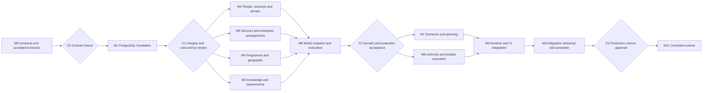

# Northstar data-structure refactor: complete implementation plan

Status: **APPROVED PLAN — IMPLEMENTATION NOT STARTED**.

Baseline: `dropandresetmain-prog/qoder-atlas`, main
`8b03934dadee20ec7ec271a45c5769de676dc3e7`.
Documentation branch: `data-structure-refactor`.
Decision: **GO / PARTIAL REFACTOR**.

Normative companion documents:

1. [Approved architecture closure](DATA_STRUCTURE_ARCHITECTURE_CLOSURE.md): frozen
   decisions F01-F18, ontology, ownership, cardinalities, lifecycles and semantics.
2. [Logical schema and transaction contracts](DATA_STRUCTURE_LOGICAL_SCHEMA.md):
   table families, integrity, indexes, JSON limits and command/execution protocols.

This document is an executable work decomposition, not permission to run production
actions. The current task records these three documents only. No runtime change,
schema migration, data import or application test execution is claimed by this
documentation commit. Existing documentation reconciliation is reserved to the
owner as requested; do not expand this change into README/roadmap/architecture edits.
Future packages update their new contract/evidence documents and identify any
owner-managed documentation reconciliation needed at integration.

## 1. Outcome, scope and execution rules

Deliver a relational, revisioned model of people, collective Trips, per-person
Journeys, shared services/reservations, mutable Programmes, external information,
requirements and multi-object recovery. Preserve sound deterministic algorithms and
provider normalization while replacing ambiguous aggregate/persistence boundaries.

The generalized product must handle solo travel, families, divergent colleagues,
corporate/agency bookings, programme changes, entry changes and advisory/condition
updates through the same engine. A plan is successful only when the architecture
acceptance tests demonstrate those behaviours and real state can be migrated and
reconciled safely. Passing CRUD tests is insufficient.

Frozen decisions are not optional lane suggestions. New modules below are proposed
locations to be materialized at M0; inspected existing modules are baseline paths.
Before each package, verify branch, worktree, actual HEAD, ancestor contracts and
live files. Do not copy a likely-file list without inspection. Do not silently
redesign shared contracts to avoid an integration mismatch.

Common exclusions until explicitly activated: live/paid provider transactions,
production cutover, unverified legal claims, arbitrary AI rule execution, demo
hardcoding, generic JSON object persistence, new microservices/graph DB/broker,
household administration, full general ledger and broad unrelated UI redesign.

### 1.1 Deliverable and evidence convention

Each package records:

- package ID, exact base and resulting commit, owned paths and dependency commits;
- changed behaviour and contracts, scoped checks actually run and their outcomes;
- failure/retry/rollback behaviour demonstrated and any unresolved exceptions;
- AT test IDs covered, fixtures used and capability mode (normally credential-free);
- triaged findings and the next dependent package/checkpoint.

Store implementation evidence in `docs/refactor/evidence/<package>.md` once the
implementation begins. Keep persistent architectural contract examples separate
from temporary agent notes. Do not include secrets, raw traveller documents or live
payment references in evidence. Commit coherent, testable checkpoints with exact
paths; final candidate evidence must identify its exact SHA.

### 1.2 Stop conditions

Stop dependent work, classify and report if an approved ontology cannot express a
required behaviour; a shared contract must change materially; external identity or
unfinished execution cannot be reconciled safely; required credentials/manual
account action is missing; a production/destructive action lacks approval; or the
bounded environment recovery protocol fails on critical work. Continue independent
work where possible. A provider unknown that the capability boundary already
represents does not require a foundational redesign.

## 2. Critical path, checkpoints and parallelism

Critical path: **M0 -> M1 -> integration of M2/M3/M4/M5 -> M6 -> integration of
M7/M8 -> M9 -> M10 -> M11**. The slowest of the domain lanes controls entry to M6;
authority/execution readiness controls live activation even if planning finishes.

| Checkpoint | Required evidence / decision | Owner and continuation rule |
|---|---|---|
| C0 after M0 | Executable contracts, logical DDL specification, invariants, AT mappings and lane collision map match F01-F18 | Primary architect accepts materialization; user needed only for an actual material change. Contract/schema freeze before domain parallelism. |
| C1 after M1 | Independent review of FK/ownership, CAS, transaction retries, inbox/outbox and migration tests | Primary integrator closes Act Now findings; domain lanes start against accepted persistence contracts. |
| C2 after M6 | Multi-object read/propagation/entry/support engine passes architecture fixtures, including phantom/time invalidation | Independent architecture review proportional to scope; primary owns resulting contract decisions. |
| C3 after M8 | Independent authority/execution review; crash, concurrency, partial success and uncertain outcomes demonstrated | No consequential capability activation until required evidence is closed. |
| C4 after M9 | Integrated credential-free runtime and multiple product scenarios; no fallback to legacy truth | Product acceptance by primary; owner review for material unresolved product choices only. |
| C5 after M10 | Exact deployable candidate, data reconciliation report, restore drill, operational readiness and known uncertain operations | **Explicit production cutover approval** from owner; this is not implied by documentation approval. |
| C6 after M11 | Target is sole writer, reconciliation complete or explicitly controlled, operating/backup verification | Owner informed with exact deployment/data evidence; close only with acceptance met. |

The primary architect/integrator owns shared contracts, identity registry, migration
number allocation, cross-root transaction rules, applicability closure, authority
envelopes and final wiring. Independent lanes never change those unilaterally.

## 3. Contract freeze package

M0 must materialize at least the following concrete contracts, with versioned schemas
and examples. Type names can be adjusted for existing conventions, but semantics
must match the approved documents.

| Contract family | Required fields/behaviour | Owner / consumers |
|---|---|---|
| Identity and ownership | Workspace/subject/root IDs, typed reference kinds, root revision, field-group ownership, protected data references | Architect; every lane. |
| DomainCommand and UnitOfWork | Typed command, actor/represented party, idempotency/hash, expected revisions, immutable assessment/plan basis for reviewed changes, causal/evidence links; typed conflict/result | Architect/persistence; all command handlers. |
| Typed canonical objects | Trip/Journey/items, support requirement/assignment, programme/participation, reservation/entitlement, credential/information/rules | Domain lanes implement exact agreed shapes. |
| ReadScope and WorldSnapshot | Complete read manifest, typed objects/effective projections, scope generations and missing coverage | M6 owner; readers from all lanes. |
| AssessmentManifest / result | Evaluator versions, revisions/generations, evidence/coverage, evaluatedAt/nextInvalidationAt, PASS/FAIL/UNKNOWN and dimensions/reasons | M6; planner/authority/UI. |
| Information ingestion | Publisher lineage, source-native fields, sequencing/effectiveness, evidence, scope, coverage and normalization version | M5; adapters/M6. |
| ScenarioChange | Registered typed proposed effects and references; cannot change judging rules/external truth | M7; planner/overlay/viability. |
| ActionPlan / Intent | DAG, typed effects, subjects, preconditions, capability, quote, costs/limits, expected observations, partial failure/compensation | M7/M8 jointly freeze at M0; integration primary owns amendments. |
| AuthorityEnvelope | Exact plan/action versions, required actors/parties, scope, limits, grant/rule inputs, expiry and fingerprint | M8; UI/planner/executor. |
| Execution / Observation | Intent-owned stable logical operation key/hash, numbered dispatch attempts, leases/fencing tokens, external identity and source-owned observed fields | M8; provider adapters/inbox. |
| Migration envelope | Dataset identity/hash, original IDs, provenance, source ordering, unknown state, importer version and target mapping | Migration owner; M2-M5/M10. |
| Extension registration | Typed object/detail schema, owner/commands, applicability reader, evaluator, invalidation, optional capability and tests | Architect/M6; future category authors. |

Provide contract examples for at least: family split/support handoff; shared booking
across Trips; programme move affecting two people's viability differently; conflicting
advisories; multi-passport transit evaluation; supplier timeout after dispatch; and
an additive new condition type. Include invalid examples, not only happy paths.

## 4. Milestone M0 — Materialize frozen contracts

**Objective.** Turn the approved design into versioned, executable boundary schemas,
precise migration specification and acceptance fixtures. This documentation commit
does not complete M0: executable contracts and verification remain future work.

**Depends on.** F01-F18 and the three approved documents. No prior implementation.

**Existing files to inspect.** `src/domain/**`, `src/operational/**`,
`src/contracts/**`, `src/engine/{mutation,overlay,impact,evaluators,authority,case}.ts`,
`src/app/{programme,recoveryExecution,eventIngest}.ts`, `src/persistence/**`,
`package.json`, existing tests and fixture structure. Verify actual paths before
edits. Read `docs/TESTING.md` and environment rules. Do not rewrite runtime types
in place during this milestone.

**New deliverables.** `src/domain/v2/**` and `src/contracts/v2/**` containing
schema/type contracts only; `docs/refactor/CONTRACTS.md`,
`docs/refactor/MIGRATION_MAPPING.md`, contract examples and architecture test fixture
definitions; exact DDL specification/migration ownership ledger based on the logical
schema. Choose filenames at this package's start and record them for later lanes.
Keep v2 unimported by production composition. Establish typed money/time/reference
and error semantics before lane work.

**Adapt / retire.** No legacy runtime retirement. Identify the exact compatibility
read projections needed later; do not create a generic writable v1 bridge.

**Migration/reseed.** Inventory legacy stores and dataset categories. Specify export
format including raw-source hashes, provider identity, personal edits, approvals
and uncertain attempts. Mark ambiguous mappings explicitly; no production export
of personal data into repository fixtures.

**Tests/checks.** Validate executable schemas against positive/negative contract
examples; inspect registry/owner and revision semantics. Run the existing
credential-free baseline broad gate once, if environment supports it, to record
known existing failures before runtime changes. Use current package scripts:
`npm run typecheck`, `npm run build`, `npm run lint`, `npm test`,
`npm run gate:anti-hardcoding` and applicable credential-free acceptance/secret
checks. Do not invent passed evidence if a provider/environment blocks a check.

**Acceptance.** Every canonical object has one owner; all schema table families and
commands have responsible lanes; support requirements cannot be relaxed through
assignment; manifests cover insertion and time; action/observation contracts cannot
promote a candidate into supplier fact; AT01-AT24 each map to packages/fixtures.

**Failure/rollback.** No production runtime imports, database writes or migration.
Revert this isolated contract commit if needed. A true frozen-contract contradiction
is an architecture gap, not permission to broaden the model locally.

**Parallel/owner.** Primary architect owns contracts. Bounded read-only audits,
legacy inventory and independent fixture review may run in parallel. Do not split
contract design among independent competing lane authors.

**Documentation/checkpoint.** Record exact contract paths, migration allocation,
known baseline issues and owned/do-not-touch paths. **C0** signs off the contract
freeze. Commit M0 before any domain implementation lane branches from it.

## 5. Milestone M1 — PostgreSQL and durability foundation

**Objective.** Implement actual relational integrity, expected-revision transactions,
migrations, audit, command receipts and durable work infrastructure in an isolated
target composition.

**Depends on.** M0/C0; F02/F03/F12/F15/F17/F18.

**Affected existing modules.** Inspect `src/persistence/database.ts`,
`repositories.ts`, `src/contracts/repositories.ts`, `src/engine/mutation.ts`, app
store constructors and runtime composition. Retain current SQLite runtime as the
existing application until cutover; it must not become a target-model backend.

**New modules/tables.** `src/persistence/postgres/**`, ordered SQL migrations,
typed UnitOfWork/read repositories, database configuration validation, test database
harness. Implement workspace/subject/head registry, schema migration ledger,
command receipts, change records, scope generations, inbox/outbox/claim work and
scheduling infrastructure. Domain migrations add their typed tables through the
same allocator. Select a maintained PostgreSQL driver with explicit parameterized
SQL/transaction control; justify the dependency and avoid hiding invariants behind
generic ORM saves.

**Adapt / retire.** Introduce construction seams; do not let the new engine write
SQL directly. Current `save(entityJSON)` and CREATE IF NOT EXISTS version stamping
are excluded from target interfaces. Keep a versioned legacy reader for migration.

**Migration/reseed.** Create isolated target/test databases only. No live import,
dual-write or replacement of current SQLite data. Foundation fixtures use target
IDs and integrity rules. Test migration from empty DB and each supported predecessor.

**Tests.** Real PostgreSQL integration tests: tenant FKs and subtype checks; stale
and equal-revision conflicts; receipt hash collision; atomic head/data/audit/outbox
commit; transaction rollback; concurrent claim, stale-worker fencing and expiry recovery; serializable
predicate conflict/retry; ordered migration checksum failure. Use two independent
connections/processes for races; SQLite/in-memory mocks cannot prove them.

**Acceptance.** No lost update under concurrent writers. Idempotent replay returns
the original receipt; changed payload with same key fails. Crash after commit leaves
durable runnable work. Incomplete migrations fail visibly. Domain handlers can use
the UoW without direct SQL from the engine. Runtime continues to use its existing
store unless explicitly launched in isolated target mode.

**Failure/rollback.** Failed migrations roll back where supported; destructive DDL
is not used against current data. Separate configurations prevent accidental legacy
or production target selection. Bound retries and return typed conflicts.

**Parallel/owner.** Primary persistence owner controls DDL ordering, registry and
transaction primitives. Test-harness work may be delegated. M2-M5 can prepare code
against C0 contracts, but integrate/run domain migrations only after M1 acceptance.

**Documentation/checkpoint.** Record database setup, migration commands, cleanup
scoping and actual concurrency evidence. **C1** independent integrity/concurrency
review must close Act Now findings before domain lane integration.

## 6. Milestone M2 — People, Journeys, coordination and credentials

**Objective.** Implement stable person identity, Trip/Journey ownership, partial
group travel, typed credentials and operational support without main/sub-travellers.

**Depends on.** M0/M1; F03-F06/F10/F11/F12.

**Affected existing modules.** `src/domain/entities.ts`, `trip.ts`, `elements.ts`,
`src/app/programme.ts` traveller/intake identity construction, `dossierStore.ts`,
preference store and profile-related contracts/read models. Inspect existing
normalization and tests before extracting reusable validators.

**New modules/tables.** `src/domain/v2/people/**`, `journeys/**`, `coordination/**`;
command handlers and typed repositories for people/governance, Trip/Journey/items,
visits/document selection, relationships, coordination membership, support
requirements and assignments. Credentials/profile assertions/history remain
Traveller-owned with protected references. Implement person consistency and
membership-generation changes. Use ConstraintDefinition for required support and
SupportAssignment for selected fulfilment.

**Adapt / retire.** Stable profile mapping replaces event/intake-derived traveller
identity. Booking dossier becomes authorized provider projection in M3/M9.
Target runtime retires `Trip.travellerIds + one embedded itinerary` as its ownership
shape; preserve the legacy reader until migration. No automatic grant from guardian,
peer, assistant or agency role.

**Migration/reseed.** Define old Trip -> Trip plus one Journey per known Traveller.
Map old elements to person itineraries only when evidence supports allocation;
never duplicate a real booking for every member to fill gaps. Ambiguous membership,
profile merge or document ownership goes to reconciliation staging. Reseed verified
demo identities explicitly, preserving original mapping for audit tests.

**Tests.** AT03-AT05, AT08-AT09 and AT24 foundations: solo/couple/family/delegation,
alternative support/handoff, dependent separation, independent partial routes,
guardian versus grant, multi-document selection and immutable credential evidence.
Test illegal cross-person credential/allocation links and membership insertion
generation. Actual entry verdict implementation follows M6.

**Acceptance.** Each person can change route independently; shared purpose persists.
Required support cannot be erased by changing assignment. Identity is independent
of event or fixture. Missing document/history is explicit. All writes use owner
revision and expose typed validation failures.

**Failure/rollback.** Isolated target data; preserve migration staging rather than
guessing identity. Revert lane before integration if needed; no legacy data writes.

**Parallel/owner.** Can run beside M3/M4/M5 after C0/M1. Own people/Journey/coordination
paths; do not change service/programme schemas or app composition. Architect owns
cross-lane person IDs, support semantics and shared reference contracts.

**Documentation/checkpoint.** Add identity mapping, profile protection and support
examples to contract/migration docs; record AT evidence. Integrator accepts lane
before M6 and before importing real Traveller records.

## 7. Milestone M3 — Services, reservations and enterprise context

**Objective.** Separate intentions, shared supplied services, booking lines,
allocations, entitlements, quotes and business servicing/accounting context.

**Depends on.** M0/M1; M2 identity contracts (implementation can run concurrently).
F05/F06/F08/F11/F14/F15.

**Affected existing modules.** `src/domain/elements.ts`,
`src/contracts/capabilities.ts`, provider adapters, `src/app/providerExecution.ts`,
`recoveryExecution.ts`, `dossierStore.ts`, `fxStore.ts`, provider observations and
normalization tests. Adapt only relevant provider interfaces; do not invent live
GDS/NDC/servicing implementations.

**New modules/tables.** `src/domain/v2/arrangements/**`, typed TransportService,
Resource, Reservation/line/allocation, entitlement/components, immutable Offer,
CommercialAgreement and accounting contracts; external connections/records/links
and field ownership commands; exact monetary representation and dated FX evidence.
Schema families match the logical schema. Capability descriptors distinguish
observe, create, service, split, cancel and other actually supported actions.

**Adapt / retire.** Keep useful provider normalization and LIVE/RECORD/REPLAY
boundaries; emit typed observations and offer records. Replace bookingRef-as-quote
convention and embedded per-Traveller booking truth in target views. Provider dossier
reads selected protected profile data; never writes competing identity fields.

**Migration/reseed.** Preserve original record IDs, supplier references, line/person
allocations and entitlement history. Deduplicate shared records only with evidence;
locator equality alone is insufficient. Separate observed stale quotes from live
reservations. Unknown issuance remains unknown, not inferred ticketed state.

**Tests.** AT06/AT07 foundations, AT16/AT18/AT24: shared PNR with different affected
lines; shared hotel with differing occupancy/dates; cross-Trip allocations; readonly
records; agency servicing grant versus capability; private offer eligibility;
reservation confirmation versus ticket issuance; stale/out-of-order observations;
exact money and currency rounding. Unsupported split/servicing returns structured
unavailable outcome. No paid/live calls in routine tests.

**Acceptance.** One canonical booking serves all its allocations. Supplier schedule
does not live in JourneyItem. Requested modifications cannot overwrite supplier
facts. Canonical observation acceptance checks identity/ownership/order. Financial
and commercial context is queryable and not hidden in JSON tags.

**Failure/rollback.** Unknown external identity quarantined; no automatic merge or
duplicate provider action. Record capability unknowns for investigation before
activation. Preserve legacy adapter outputs through a temporary read-only projection
only where needed for differential tests, not dual-write.

**Parallel/owner.** Independent beside M2/M4/M5. Adapter normalization tests can run
as bounded tasks after canonical contracts freeze. One owner controls external
identity, observation semantics and monetary contract; M8 owns dispatch authority.

**Documentation/checkpoint.** Record external identity mapping and capability truth,
including provider unknowns and revisit conditions. Integrator accepts before M6;
live activation additionally requires C3 and verified supplier facts.

## 8. Milestone M4 — Mutable programme and geographic model

**Objective.** Make event scheduling an actual independently owned recovery surface,
and establish operational places versus spatial areas and legal jurisdictions.

**Depends on.** M0/M1; M2 person and M3 resource contracts. F06/F07/F11/F12/F15.

**Affected existing modules.** `src/app/programme.ts`, `eventChangePreview.ts`,
programme intake contracts/mapping, `signalPipeline.ts`, programme/read-model tests,
AnchorEvent/AnchorCommitment and Place definitions. Current separate preview
heuristic is a retirement target, not a target evaluator implementation.

**New modules/tables.** `src/domain/v2/programmes/**`, `geography/**`, commands for
schedule/participation/resource changes; Event, Programme, ProgrammeItem,
Participation/roles, ResourceAssignment, Place, area geometry editions,
memberships and Jurisdiction associations. Implement internally owned versus
externally owned schedule admission. Emit one authoritative change and resumable
fan-out signal; later M6 readers resolve complete closure.

**Adapt / retire.** Intake becomes importer of real canonical programme/person
objects. Engagements reference Participation and derive time/place. Retire target
AnchorCommitment copies, cancellation-as-reservation-state and six-hour preview
heuristic. Until M6/M9 wiring, new target preview reports evaluation unavailable or
uses actual target evaluator contract; never fake a passing preview.

**Migration/reseed.** Map old AnchorEvent to Event+Programme and commitments to
ProgrammeItems, preserving source identities. Reconcile inconsistent copied
engagement schedules and cancellation flags; do not silently select a convenient
copy. Create participation from justified links, including local nontravelling
participants. Curated area/jurisdiction data has source/version metadata.

**Tests.** AT01/AT02 foundations, AT13/AT14/AT16: shared time change/cancellation/
reinstatement; multiple Programmes; local participants; one traveller with multiple
roles; concurrent schedule/resource capacity commands; geography and jurisdiction
not conflated; stale resource/read projection. Test accepted external conflict
versus admission of a new internally controlled conflicting schedule.

**Acceptance.** A programme move changes one owner and advances one Programme
revision; dependent projections invalidate. Programme state survives intake reload
and is not rewritten from fixture. Schedule/resources can be affected across Trips.
Spatial scopes have valid versioned geometry and effective jurisdiction membership.

**Failure/rollback.** Failed admission leaves programme unchanged with typed reason.
Committed external observation can expose a conflict and queues recovery. Partial
fan-out is resumable and visible as stale/pending assessment, not partial truth.

**Parallel/owner.** Beside M2/M3/M5 using frozen refs. One schedule owner controls
programme/resource concurrency. Geography contract is shared with M5/M6; those
lanes cannot redefine legal-area semantics.

**Documentation/checkpoint.** Record schedule authority/import mapping and spatial
examples. Integrator accepts before M6. Full multi-person viability acceptance is
completed with M6/M7/M9, not claimed from CRUD alone.

## 9. Milestone M5 — External knowledge, provenance and requirements

**Objective.** Represent advisory/condition/regulatory publication lineages,
conflicts, time applicability, source coverage and organisational reaction rules.

**Depends on.** M0/M1; M2 population/profile and M4 geography contracts.
F06/F09/F10/F11/F12/F16.

**Affected existing modules.** `src/domain/common.ts`, `rules.ts`, `constraints.ts`,
ingestion/research contracts and services, source repositories, information-related
fixtures and rule evaluators. Inspect all current authority/freshness usage before
adapting; do not remove provenance while replacing a universal rank.

**New modules/tables.** `src/domain/v2/knowledge/**`, `requirements/**`; immutable
Source/Evidence, publisher InformationRecord/Version and typed advisory/condition/
regulatory detail, coverage and sync state, published RuleSet editions/assignments,
typed constraints/operands. Registered bounded predicates define executable
requirements; publication metadata references exact rule edition. Source adapters
preserve native severity, sequencing, geography/population and uncertainty.

**Adapt / retire.** Fact wrappers may be mapped to evidence; retire universal
source-rank selection as domain truth and persisted constraint result on definition.
Retain raw captures under access controls. Capture unsupported categories without
claiming evaluative understanding. No arbitrary AI-to-executable-policy conversion.

**Migration/reseed.** Transform existing sourced policies/claims into justified
editions with explicit unknown coverage where legacy data is incomplete. Preserve
raw source/hash and authority label as legacy evidence, not invented government
endorsement. Reseed demo regulatory examples as synthetic, never real legal guidance.

**Tests.** AT10-AT13 foundations, AT18/AT21: differing publishers and organisational
responses; faster lower-authority report; future-effective rule; supersession,
retraction and late receipt; empty/incomplete coverage; new applicability insertion;
clock-based expiry; idempotency collision. Test rule-expression schema limits and
UNKNOWN propagation under unsupported interpretation.

**Acceptance.** Each publisher owns its lineage; new editions never erase dissenting
sources. Freshness separates receipt from observation/effective time. New relevant
information invalidates matching scopes even with no booking change. Organisational
policy never rewrites original source meaning.

**Failure/rollback.** Invalid/conflicting normalization is captured/quarantined;
accepted prior editions remain traceable. Missing paid/provider access permits
synthetic/recorded tests and UNKNOWN, not fabricated production coverage.

**Parallel/owner.** Beside M2-M4. Individual adapters can be delegated once schema
and normalization rules are fixed. Primary owns authority/coverage semantics and
policy publication, with M6 owner controlling evaluated meaning.

**Documentation/checkpoint.** Record source contracts, licensing/coverage unknowns,
rule operator catalog and extension example. Integrator accepts before M6;
production entry/advisory claims need investigation evidence, not only schema tests.

## 10. Milestone M6 — Unified world state, consequences and viability

**Objective.** Build complete, deterministic multi-object evaluation over the target
owners, including real entry, support and programme feasibility, with provable
staleness invalidation.

**Depends on.** Integrated M2-M5, accepted M1; F06/F10-F13/F16.

**Affected existing modules.** `src/operational/snapshot.ts`,
`src/engine/evaluationContext.ts`, `impact.ts`, `evaluators.ts`,
`connectionFeasibility.ts`, `overnightStay.ts`, `concentration.ts`, `funding.ts`,
`fx.ts`, `viabilityReconciliation.ts`, snapshot/read model services and tests.

**New modules/tables.** `src/resolution/world/**`, `impact/**`, `evaluation/**`;
scope readers, effective itinerary projector, applicability matching, typed
dependency registry, Assessment/manifest/results and input rows, exposure indexes,
scheduled reassessment worker. Entry encounter derivation and registered regulatory
evaluator, support continuity/group constraints and programme/resource evaluators.
Keep evaluation pure over captured WorldSnapshot; injected clock and source quality
are explicit inputs.

**Adapt / retire.** Reuse pure time/buffer utilities unchanged where tests prove
independence. Adapt connection, overnight, concentration, objective/funding logic to
target input DTOs. Replace ENTRY-always-UNKNOWN with actual supported predicate
evaluation that still returns UNKNOWN outside evidence/coverage. Retire target
single-Trip snapshots, cached health feeding evaluation, unused duplicated
dependencies and hardcoded preview buffers. Temporary v1 read projections exist
only for differential algorithm tests and are removed before cutover.

**Migration/reseed.** Recompute all target health/viability/entry/risk assessments.
Legacy assessment history is explicitly legacy evidence, never current verdict.
Build exposure indexes from canonical data with certified source generations.

**Tests.** AT01-AT06, AT08-AT15, AT19-AT22 evaluator portions. Require inserted rule,
new group member, new information and clock-only expiry invalidation; multiple
credential selection consistency; incomplete travel history/airside facts; support
coverage throughout split routes; programme move helping one and harming another;
cross-Trip shared object closure; cycles terminate without inventing graph semantics.
Use differential tests only for actually preserved algorithms; investigate changed
verdicts rather than accepting snapshots mechanically.

**Acceptance.** Every result has complete read/coverage/time manifest. Currentness
can be checked without trusting UI cache. Required uncertainty cannot become PASS
by absence. New source/category scope is conservative until exact applicability
exists. All affected people are evaluated, not averaged. Mandatory constraints
still apply after authorized objective loss.

**Failure/rollback.** Unsupported evaluator/coverage returns typed UNKNOWN and
blocks dependent consequential actions as policy requires. Stale/incomplete exposure
index falls back to conservative reads or explicit unavailable assessment. Failed
reevaluation remains pending/retryable, never silently current.

**Parallel/owner.** This is a primary-owned integration milestone. Separate pure
evaluators can be delegated against frozen manifest/context semantics, but one owner
controls closure, insertion/time invalidation, aggregate scope and resulting API.

**Documentation/checkpoint.** Publish evaluator registry, manifest examples,
extension guide and AT evidence. **C2** independent architecture acceptance must
close material gaps before planner/execution integration.

## 11. Milestone M7 — Multi-object strategies and typed action planning

**Objective.** Make planning propose isolated, complete scenarios and compile them
into reviewable executable action DAGs without mutating current world state.

**Depends on.** M6/C2; frozen M0 ActionPlan/authority/execution contracts.
F07/F11/F13/F14/F16.

**Affected existing modules.** `src/engine/overlay.ts`, planner contracts,
intelligence/planning services, planning loop, initial change proposal flow and
action derivation in `src/app/recoveryExecution.ts`. Inspect actual paths for
planning services before assigning lane ownership.

**New modules/tables.** `src/resolution/scenarios/**`, `planning/**`;
RecoveryStrategy versions, typed ScenarioChanges, ActionPlan/Intent/dependencies and
compiler. Candidate facts live in an overlay with manifest, affected subjects and
expected post-action observations. Compile supported internal programme commands
and external capabilities explicitly, including cost/quote/party context and
partial-success/compensation policy.

**Adapt / retire.** Preserve AI proposal/schema gating and deterministic fallback
where sound; adapt prompts/input DTOs to multiple Journeys/shared objects. Retire
generic entity-upsert candidates and first-flight/stay inference. No automatic
simulation fallback may masquerade as live success. Explicit waivers/losses are
separate proposed dispositions with their own authority, never rule edits.

**Migration/reseed.** Archive old proposal versions; regenerate active candidates
from target state and fresh assessments. Do not execute an old generic strategy via
automatic translation without revalidation and new scoped authority.

**Tests.** AT02/AT07/AT15/AT19-AT22 planning portions: all affected people included;
no current-state mutation; no fake passport issuance/supplier retiming; policies and
support requirement cannot be rewritten; programmatic reschedule; independent
approvals; safe ordering with partial failures; unknown quotes/capability block
unsupported action; materially different scenarios use same compiler/evaluator.

**Acceptance.** Selected strategy is immutable/versioned and deterministically
viable under manifest. Every intended consequential effect maps to a typed action
and observation contract. Action graph is acyclic. Unsafe partial group split is
not presented as executable solely because final hypothetical state looks good.

**Failure/rollback.** Unsupported action or failed viability remains explained
candidate rejection/manual path. Model failure uses truthful deterministic fallback
or structured uncertainty. Preserve current state and prior candidate history.

**Parallel/owner.** Runs beside M8 after M6. M7 owns scenario/planner/action compiler;
M8 owns authority/dispatch. Neither changes shared ActionPlan contracts alone.
Primary architect resolves seam changes and shared acceptance fixtures.

**Documentation/checkpoint.** Add action catalog and partial-success examples,
model boundary constraints and planner evidence. Integrator accepts before M9;
capability execution additionally requires M8/C3.

## 12. Milestone M8 — Scoped authority and durable execution

**Objective.** Implement auditable multi-party permission, exact budget protection,
safe dispatch, observation ownership and truthful reconciliation across shared state.

**Depends on.** M6/C2, M3 capability contracts and M0 ActionPlan contract; can run
beside M7 using validated contract fixtures. F08/F12/F14/F15/F18.

**Affected existing modules.** `src/engine/authority.ts`, `executor.ts`,
`observation.ts`, `case.ts`, funding/FX seams; `src/app/recoveryExecution.ts`,
`providerExecution.ts`, `eventIngest.ts`, `eventInboxStore.ts` and case/intents stores.
Preserve useful case phases; replace unsafe orchestration, not only table layout.

**New modules/tables.** `src/resolution/authority/**`, `execution/**`,
`reconciliation/**`; grants/decisions, independent approval requirements/envelopes,
approval/revocation, exact budget commitments/entries, attempts/observations and
durable claim workers. Internal programme executor uses revision-checked command
receipt. External adapters dispatch only declared capabilities and normalize actual
observations. Case scope/action coordination prevents duplicate shared operations.

**Adapt / retire.** Remove case-wide reusable approval envelope, receipt-only inbox
deduplication, direct candidate-field promotion and loss-resolution shortcut from
target execution. Preserve useful provider idempotency keys but enforce request
fingerprint equality, durable uncertain outcome and lookup-before-retry. Authorization
cannot depend on descriptive organisation/guardian roles alone.

**Migration/reseed.** Historical approvals remain immutable history and do not
become new grants. Open actions need fresh target assessment/authority; preserve
existing external operation keys and uncertain outcome evidence for reconciliation.
Never reset unknown attempts into ready-to-purchase work. No live execution here
without separate capability/account authorization.

**Tests.** AT04/AT07/AT14-AT20/AT24. Two workers race to spend budget/claim same
reservation action; price/grant/member change after approval; multiple actors needed;
revocation/expiry; crash before dispatch, after possible send, after supplier success
before local observation; lost response and late webhook; repeated key different
payload; partial provider success; internal programme commit; accepted loss with
remaining support/entry/overnight failure. Fault injection at durable boundaries
is mandatory, not only mock success/failure returns.

**Acceptance.** No AI/ungated provider dispatch. Unknown outcome cannot cause a fresh
purchase or premature budget release. Observation updates correct source-owned
fields. Internal commands and external observations use distinct truth paths.
Approval covers exact current envelope, all required actors and limits. Recovery
cannot resolve merely from API success or an accepted unrelated loss.

**Failure/rollback.** Bound retries; unsupported idempotency/lookup escalates before
duplicate dispatch. Compensation is separately authorized and observed. Do not
promise DB rollback undoes supplier success. After real external action, operational
rollback requires reconciliation, not restoring an older local database alone.

**Parallel/owner.** High-risk primary-owned milestone; bounded adapter/fault-test
tasks permitted. One architect owns grant/envelope, budget, claim and reconciliation
semantics. M7 parallelism stops at shared-contract contradiction.

**Documentation/checkpoint.** Record action/authority state transition guards,
retry matrix, crash evidence and provider unknowns. **C3** independent authority and
execution review is required before enabling any consequential capability.

## 13. Milestone M9 — Application composition and product integration

**Objective.** Wire one coherent target runtime and understandable UI/read APIs over
the canonical owners and actual recovery engine.

**Depends on.** M2-M8 integrated; C2/C3 closed. F01/F04/F06/F07/F12-F15.

**Affected existing modules.** Application/runtime composition, dispatch and signal
pipeline, intake/programme/recovery routes, `src/contracts/readmodels.ts`, server/UI,
acceptance runners and fixtures. Primary inspects actual entrypoints before wiring.

**New modules/contracts.** Target composition/repositories/workers, read models for
Trip members and per-person route, programme schedule, shared reservation allocations,
assessments current/stale/pending, scoped approval and execution status. Replace
legacy DTO consumers with target projection adapters; do not expose all internal
schema fields to the user. Use typed API validation and meaningful error states.

**Adapt / retire.** New runtime uses only target authoritative stores. Remove
target fallbacks to SQLite JSON, mutable commitment copies and duplicate preview
heuristics. Keep legacy application runnable separately for migration/reference
until cutover, not as fallback writer inside the new process.

**Migration/reseed.** Run on isolated target datasets. Intake creates/upserts
canonical identity through accepted mappings and never resets later edits from
fixture replay. Regenerate target fixtures and projections; no dual-write.

**Tests.** AT01-AT24 integrated subsets, especially AT22: family holiday with partial
split, corporate delegation with shared/readonly bookings, and outdoor event
programme disruption. Ingestion -> owner update -> impact -> scenario -> authority
-> boundary execution replay -> observation -> reconciliation must be real internal
code in every case. Exercise stale UI refresh, pending work and unsupported
capability messages. Verify no names/IDs/routes hardcoded in domain/recovery logic.

**Acceptance.** Same engine handles materially different cases; UI can explain who
owns a changed value and why assessment is uncertain/stale. No hidden legacy writer
or fake internal pipeline. Protected identity/offer data respects Workspace and
party access. Offline/replay mode stays credential-free at external boundaries.

**Failure/rollback.** Target dataset isolated; failure cannot alter current deployed
store. Worker/API failures preserve pending durable work. Missing optional connector
does not crash core; unsupported action remains structured and truthful.

**Parallel/owner.** Integrator owns composition/shared API changes. UI presentation
and bounded end-to-end fixtures may run independently after read contracts freeze;
they cannot reintroduce alternate state ownership for convenience.

**Documentation/checkpoint.** Record launch/configuration, scenario evidence and
legacy writer inventory; identify owner-managed public-doc reconciliation needed.
**C4** integrated product acceptance before migration/cutover candidate.

## 14. Milestone M10 — Migration rehearsal and final candidate

**Objective.** Prove data preservation, reconciliation, restoration and legacy
retirement on an exact deployable candidate before touching production authority.

**Depends on.** M9/C4; migration inventory from M0 and mappings M2-M5; F17/F18.

**Affected existing modules.** SQLite readers/store schemas, reset/seed tools,
deployment/configuration, CI/acceptance scripts and target migration infrastructure.
Inspect actual deployed data/environment; fixture assumptions are not migration
evidence. Keep private data outside tracked repository paths.

**New modules/tables.** Offline legacy exporter, staging importer, reconciliation
and validation tools, mapping/report outputs, idempotent migration runs, restore
runbook and cutover checklist. Preserve versioned offline legacy reader. Construct
a target candidate without legacy runtime writes or compatibility fallback.

**Adapt / retire.** Remove temporary differential/read compatibility from target
runtime; archive source evidence/results as required. Legacy schema reader remains
offline only. Inventory old worker endpoints, scheduled jobs and credential routes
to disable at cutover. Do not delete audit/raw source files as cleanup.

**Migration/reseed.** Apply the per-category matrix below. Rehearse on a copy, with
source hash, record counts, mappings, unresolved obligations and unknown operations.
No import performs provider actions. Reconcile real references through read-only
provider capability where authorized; unresolved mandatory identity/outcome blocks
activation for that scope or cutover if it cannot be isolated safely.

**Tests/checks.** AT23 plus interrupted export/import resume, duplicate import,
conflict quarantine, field/source preservation, operational backlog and backup
restore. Validate relational integrity, money totals and unresolved obligation
counts, not just row count. Run canonical broad gate once on the exact final
candidate SHA using repository scripts and applicable target PostgreSQL/acceptance
gates. Reuse prior lane evidence; rerun only changed seams until final candidate.

**Acceptance.** No real edits, refs, approvals/history or uncertain executions lost.
Derived state is recomputed. Candidate restores from backup. All material migration
exceptions have decision/owner; no unsafe action becomes runnable on import. Exact
candidate, configuration and dataset version identified. No runtime legacy writes
remain in that candidate.

**Failure/rollback.** Production stays on old authority during rehearsal. Discard
only isolated failed target imports after preserving diagnostics; rerun idempotently.
Rollback procedure distinguishes before-first-new-external-action from after.
Protect verified absolute paths for cleanup and keep source archive intact.

**Parallel/owner.** One migration/cutover owner; bounded inventory/report checks and
independent final review may run parallel. Do not let lane agents migrate live data
or independently change importer identity decisions.

**Documentation/checkpoint.** Migration evidence, restore results, live capability
unknowns, deployment runbook, candidate SHA and exact C5 request. **C5 requires
owner approval for production cutover**, even though architecture is approved.

## 15. Milestone M11 — Controlled cutover and retirement

**Objective.** Establish PostgreSQL target as the sole authoritative runtime, with
verified data, reconciled work and no competing legacy writer.

**Depends on.** Exact M10 candidate, C5 approval, hosting/backup/access readiness,
required provider authority/lookup facts. F14-F18.

**Affected modules/operations.** Prefer no source changes: deploy the approved SHA.
Execute approved configuration, worker/API and database switch. Any material code
change creates a new candidate and requires relevant evidence before activation.

**Sequence.**

1. Announce/record approved maintenance boundary and freeze legacy intake, mutation,
   scheduled workers and consequential dispatch; verify no active untracked writer.
2. Inventory in-flight operations; record uncertain external outcomes and keys.
   Do not let a process shutdown imply provider failure.
3. Take verified backup/export with source dataset hash and cutoff time. Import via
   rehearsed mappings into target, validate obligations and exception policy.
4. Reconcile outstanding provider identities/outcomes as authorized. Quarantine
   unsafe scopes; do not enable new actions that could duplicate uncertain work.
5. Switch reads and then controlled target writes/workers to PostgreSQL, recording
   the authority-switch time. Disable old endpoints/workers/credential routes.
6. Verify actual target reads, command receipts, outbox processing, assessment
   freshness and configured backup operation. Enable consequential capabilities only
   where authority/provider evidence and reconciliation permit.
7. Retain old data/read-only exporter as protected archive; remove legacy runtime
   dependencies/configuration through a later exact-scope cleanup if not already
   excluded in M10. Confirm no fallback to old state on target failure.

**Migration/reseed.** Final delta is captured by write freeze/export; no routine
dual-write needed. Seed only identified synthetic datasets. Real user changes and
provider refs follow migration matrix, never reset to fixture convenience.

**Tests/checks.** Controlled read/command/queue checks and reconciliation evidence on
deployed candidate; no unsolicited paid purchase as smoke test. Verify disabled
legacy writers, restored pending jobs, privacy access and backup/restore readiness.
Recompute assessments after import before claiming healthy/recovered state.

**Acceptance.** Old architecture stops being authoritative **at the recorded M11
switch**, not when tables or docs were added. Target is sole writer. Every imported
uncertain operation is reconciled or isolated with explicit operator ownership and
no duplicate-dispatch path. Product and operational acceptance from C5 holds.

**Failure/rollback.** Before new external effects, a controlled return to frozen
legacy authority may be possible using verified data boundaries. After new provider
actions, do not restore an old DB and forget effects; suspend dispatch, reconcile
and repair forward or perform a separately approved reverse migration. Keep all
attempt IDs, receipts and evidence.

**Parallel/owner.** Single integrator/cutover owner. Read-only verification may be
delegated; no parallel deployment/writer activation. **C6** records final operating
state, candidate SHA, data generation, unresolved controlled exceptions and ownership.

## 16. Migration decision matrix

| Existing data category | Decision | Transformation / validation and failure policy |
|---|---|---|
| Seed/demo fixtures | Transform and reseed | Only demonstrably synthetic dataset. Use several general scenarios; retain source mapping for test comparability. Never treat all deployed rows as fixtures. |
| Externally sourced current state | Migrate then reconcile | Preserve record identity, original observation/effective times and evidence. Mark stale until supported refresh; do not call it newly observed at import time. |
| Traveller/profile/programme edits not in fixtures | Migrate/transform | Export actual store values with sources/revisions; detect conflicting embedded copies. Do not replay intake over later user changes. |
| Real provider booking/order/ticket references | Migrate and reconcile | Preserve protected IDs/connection context, ticket components and exchange history. Merge only with identity evidence; ambiguous refs quarantined. |
| Historical approvals/decisions | Archive as immutable history | Preserve actor, scope known at time and source. Do not invent target grant/envelope or reuse broad old approval for new actions. |
| Open recovery cases and losses | Transform and reassess | Preserve case continuity, signals, known losses and responsibilities; map all affected subjects. Regenerate candidates/authority from target state. |
| Unfinished/uncertain execution | Reconcile before dispatch | Preserve logical operation key, request fingerprint, provider refs and evidence. Unknown is not failed; no new purchase retry key. |
| Uploaded/raw source material | Migrate protected content or retain verified archive reference | Preserve hashes, metadata, access/licensing/retention. Never place raw private data in Git. |
| Derived health, risk, viability, read caches | Recompute; discard current-cache role | Legacy results may remain labeled historical evidence. Never migrate as current assessment without complete new manifest. |
| Old unexecuted strategies/overlays | Archive and regenerate | They use invalid aggregate/action contracts; never execute by blind translation. |
| Preferences/accounting assignments | Transform with provenance | Preserve explicit versus inferred precedence and known payer/context. Missing ownership remains an exception, not an assumed default. |
| Conflicting programme/engagement copies | Reconcile | Source/owner evidence decides mapping; preserve disagreement in migration report. Cancellation must map to real ProgrammeItem lifecycle. |
| Legacy multitraveller Trip with unallocated elements | Investigate then transform | Create per-person Journeys, but do not guess booking ownership/person coverage; block affected action scope until mapping is justified. |
| Orphan/invalid rows | Quarantine/archive; repair only with evidence | Keep obligations/provider references discoverable. Discard only proven unneeded synthetic/cache rows. |
| Audit history | Preserve original immutable archive plus mapping | Do not fabricate missing historical revisions or actor authority. Link target records to original evidence. |

Migration tooling is idempotent by dataset+source identity and records importer
version, source hash and mapping decisions. A repeat import with changed payload is
a conflict requiring explicit reconciliation, not silent overwrite. No importer
dispatches travel/payment actions. Query source data read-only until C5-controlled
freeze; avoid dual-write complexity unless later measured availability requirements
make a documented alternative necessary.

## 17. Architecture acceptance catalogue

Each test must use real domain commands/evaluation/authority/reconciliation and a
real PostgreSQL store where persistence/concurrency matters. Mock only external
provider/action boundaries. Freeze synthetic input sources so tests do not depend
on changing immigration or weather advice. Inject clock for time transitions.

| ID | Behaviour demonstrated / required assertion | Primary packages |
|---|---|---|
| AT01 | Shared ProgrammeItem time update changes exactly one canonical schedule; every linked Journey invalidates and unrelated nonmatching scope remains unaffected after complete matching. | M4/M6/M9 |
| AT02 | Moving an item helps one participant but harms another/resource; complete scenario detects both and blocks unauthorized/nonviable move. Cancellation/reinstatement are real state. | M4/M6/M7/M9 |
| AT03 | Dependant retains required support across movement, transfer and stays; alternative eligible adults/handoffs work; stranding or relaxed requirement cannot pass. | M2/M6/M7 |
| AT04 | Guardian relationship, peer membership, agency responsibility and spending/consent grant are distinct. An authorized supporter is not automatically a payer. | M2/M8 |
| AT05 | Travellers split route midway without duplicate person/Trip/booking truth; different Journeys retain collective objectives and scoped coordination. | M2/M3/M6 |
| AT06 | A changed shared reservation line affects its allocated people and expands only through applicable coordination/dependency rules; one booking can span Trips. | M3/M6/M9 |
| AT07 | Joint recovery requires all relevant approvals, owns shared action once, and preserves partial supplier success without unsafe separation or duplicate retry. | M7/M8/M9 |
| AT08 | Same itinerary yields different entry results for different group members; joint feasibility respects mandatory individual eligibility/support. | M2/M6/M9 |
| AT09 | Multi-passport/linked visa use is consistent; expired/wrong-linked document, missing transit facts and incomplete cumulative travel history cannot produce unjustified PASS. | M2/M6 |
| AT10 | A newly inserted or future-effective applicable entry rule invalidates previous assessment even though no previously read booking/document row changes. | M5/M6 |
| AT11 | Fast lower-authority advisory/condition remains attributed correctly; conflicting official statements persist; organisations apply different explicit responses. | M5/M6/M9 |
| AT12 | Time-only quote, information, credential threshold and approval/grant expiry produce durable invalidation/reassessment including downtime catch-up. | M1/M5/M6/M8 |
| AT13 | Geography/time/population matching finds complete exposure; unknown location/coverage cannot prove unaffected. Area/jurisdiction changes invalidate matching scope. | M4/M5/M6 |
| AT14 | Concurrent schedule/member/allocation/budget changes cause correct conflict/retry with no lost update, over-allocation or overspend. Use independent DB connections. | M1/M4/M6/M8 |
| AT15 | Change to membership, price, source revision, grant or permitted loss after approval forces reevaluation and envelope validation before action. | M6/M7/M8 |
| AT16 | External request remains proposed/pending until observation; successful internal programme command immediately owns its state via committed receipt. No wholesale candidate promotion. | M3/M4/M8 |
| AT17 | Crash after inbox receipt and after possible provider dispatch resumes safely; uncertain outcome triggers lookup/reconciliation before retry. | M1/M8 |
| AT18 | Duplicate equal payload is idempotent; same key/different hash is conflict; late webhook cannot overwrite newer accepted observation. | M1/M3/M5/M8 |
| AT19 | Scenario cannot alter legal/policy/support judging criteria, issue documents, invent supplier confirmation or waive obligations without separate valid authority. | M6/M7/M8 |
| AT20 | RECOVERED_WITH_LOSS applies only to specific authorized dispositions; remaining entry/support/overnight failures and material uncertain attempts prevent false resolution. | M6/M8/M9 |
| AT21 | An engineer outside the kernel implementation adds weather, EV charging and accreditation examples through declared typed schema/readers/evaluators/invalidation. No Trip/Journey/Case ownership rewrite or generic JSON bypass. | M5/M6/M9 |
| AT22 | Family holiday, corporate delegation and outdoor event programme scenarios execute the same generalized pipeline with different fixture facts only. | M6-M9 |
| AT23 | Migration preserves real edits, provider refs, approvals/evidence and uncertain operations; derived results are recomputed; interrupted import/restore is safe. | M10 |
| AT24 | Workspace isolation, personal credential disclosure, private offer eligibility, servicing permission and represented-party authority reject unauthorized cross-scope access/action. | M1-M3/M8/M9 |

AT21 is an architecture test, not a theoretical README example. Have an engineer
who did not define the core evaluation kernel implement a bounded new category
using the extension guide. An additive type/table/evaluator is acceptable. Requiring
a new universal object bag, an engine-specific traveller special case or a rewrite
of core ownership fails acceptance. Retain at least two additional examples beyond
weather so the extension mechanism is not weather-specific.

## 18. Current-to-target module disposition

| Current area | Keep / adapt / replace / introduce | Target boundary |
|---|---|---|
| Pure time/instant/preference utilities | Keep where shape-independent tests support it | Pure deterministic functions with explicit inputs/clock. |
| Connection/overnight/concentration/objective/funding algorithms | Adapt inputs/outputs; correct cached-health/float dependencies | Effective world/evaluator contracts and exact money. |
| `src/domain/trip.ts`, `elements.ts`, AnchorEvent embedded shape | Replace target aggregate ownership | Trip/Journey, service/reservation/entitlement, Event/Programme/Participation. |
| `src/domain/common.ts` provenance | Adapt and expand | Immutable sources/evidence, source-specific publication/coverage. |
| `src/operational/snapshot.ts` | Replace | Consistent WorldSnapshot plus complete manifest. |
| `src/engine/impact.ts` relation/storage assumptions | Adapt sound consequences, replace duplicate graph/status mechanism | Typed references, CONNECTS_TO/REQUIRES and applicability closure. |
| `src/engine/overlay.ts` isolation principle | Keep principle, replace aggregate/action contract | Immutable multi-object scenarios. |
| ENTRY evaluator and shallow research query | Replace/introduce | Credential/encounter/rule/coverage evaluation. |
| `src/engine/case.ts` useful phase machine | Adapt guards/scope | Multi-subject case with specific loss disposition and reconciliation. |
| `src/app/recoveryExecution.ts` generic upsert/approval orchestration | Replace | Typed plan/compiler, scoped approvals, durable attempts and owner observation. |
| Provider adapters/normalization | Preserve where correct; adapt typed contracts | Capability and observation boundary, no core supplier-specific logic. |
| `src/app/programme.ts` intake/fan-out | Adapt import/extract utility, replace canonical ownership/fan-out durability | Real Programme commands and queued consequence evaluation. |
| `eventChangePreview.ts` separate heuristic | Retire | Same target evaluator for preview and execution. |
| SQLite database/repository JSON and direct engine SQL | Replace for runtime; retain offline reader | PostgreSQL typed repositories/UoW/migrations. |
| `eventInboxStore.ts` receipt-only dedup | Replace | Inbox delivery plus resumable per-target work. |
| Booking dossier/profile copies | Replace editable duplicate; adapt DTO | Selected credential/name projection with protected access. |
| UI/read models | Adapt | Explicit canonical references and current/stale/pending computed state. |

## 19. Material issue triage and disposition

| Issue | Classification | Required action / owner / risk of deferring |
|---|---|---|
| Trip/person/booking ownership ambiguity | Act Now | M2/M3 split ownership. Deferral prevents correct group/shared recovery. |
| Programme/engagement duplicated schedule and preview logic | Act Now | M4/M6 unified owner/evaluation. Deferral produces contradictory time and blast radius. |
| Support requirement mixed with selected supporter | Act Now | M0/M2 separate constraint from assignment. Deferral lets a strategy relax obligations to pass. |
| Entry shallow profile/query and unsupported evaluator | Act Now | M2/M5/M6 credential/encounter/coverage contracts and evaluator. Deferral prevents truthful itinerary-specific eligibility. |
| Universal source authority rank and missing publication coverage | Act Now | M5 source-specific editions and coverage. Deferral misrepresents emerging/conflicting information. |
| Duplicate dependency mechanisms and cached status feedback | Act Now | M6 typed references/semantics and immutable results. Deferral makes propagation and viability unreliable. |
| Stale assessments missing inserted objects/time | Act Now | M1/M6 scope generations and durable expiry. Deferral permits outdated authority/execution. |
| Case-wide approval and generic candidate execution | Act Now | M7/M8 exact typed actions/envelopes. Deferral permits unintended actions and false truth. |
| Inbox lost work and uncertain execution retry gaps | Act Now | M1/M8 durable claims/attempts/observation. Deferral can lose changes or duplicate consequences. |
| Logical operation identity versus dispatch attempts, temporal ownership and stale-worker fencing | Act Now | Materialize exact Intent key/attempt sequence, explicit owner transfer, assessment basis and claim tokens in M0/M1/M8. Deferral allows duplicate dispatch or stale authority despite revision checks. |
| Blob persistence, equal-version overwrite, direct SQL | Act Now | M1 and domain repositories with CAS/FKs. Deferral preserves lost-update and ownership failures. |
| Recovered-with-loss bypass of remaining mandatory checks | Act Now | M6/M8 guarded resolution. Deferral falsely labels unsafe state recovered. |
| Actual deployed data and unfinished operation inventory unknown | Investigate Now | M0 inventory, resolve before M10/C5. Assuming fixtures risks loss of real obligations or duplicate purchases. |
| Entry license, coverage, interpretation and freshness | Investigate Now | M5/M6 integration owner, resolve before production claims. Keep unsupported scope UNKNOWN. |
| Advisory/weather edition/authority semantics | Investigate Now | M5 connector owner before source activation. Guessing can accept late/retracted claims as current. |
| Supplier lookup/idempotency/split/servicing facts | Investigate Now | M3/M8 owner before capability activation. Unsupported capability stays unavailable; guessing risks money or booking loss. |
| Real identity/grant/guardian/agency verification process | Investigate Now | M2/M8 owner before live authority. Model alone cannot certify real permission. |
| Hosting/PostGIS/backup/protected-source storage | Investigate Now | M1 operations then M10/C5 readiness. Deferral to after cutover risks loss/access failures. |
| Exact cause of previous SQLite incidents | Investigate Now | Inspect deployment/log evidence separately, bounded. Do not diagnose corruption without proof or treat PG as automatic cure. |
| Advanced schedule/tour/inventory optimization | Park for Later | Basic identity/capacity now; optimize when measured scale/product needs justify. Deferral limits optimization, not correct ownership. |
| Visa application processing, household administration, full GL | Park for Later | Keep credential/workflow/accounting boundaries; add capability only with actual scope. Deferral leaves manual work, not false claimed automation. |
| Fine-grained invalidation, CDC, external broker | Park for Later | Start conservative generations/Postgres workers; revisit measured throughput. Correctness preserved at cost of extra evaluation. |
| Solo Trip plus Journey overhead | Ignore / Accept Risk | Accept one extra aggregate to preserve consistent group semantics; avoid special solo shape. |
| Additive typed migrations for genuinely new concepts | Ignore / Accept Risk | Expected extensibility cost; not a foundational refactor. Generic JSON shortcut would be worse ownership. |
| World changes just after external dispatch | Ignore / Accept Risk | Unavoidable boundary; preserve observations/reconcile and invalidate remaining actions. Never claim cross-provider atomicity. |

Deferred capability decisions are recorded here for the owner's later roadmap
reconciliation. They are not silently dropped or newly authorized implementation.

## 20. Lane ownership and handoff package

After C0 and M1, safe parallel implementation lanes are:

| Lane | Owns | Must not change independently |
|---|---|---|
| People/Journeys/groups (M2) | New people, Journey, coordination and credential modules/tests/mapping | Shared identity registry/UoW, programme/service schemas, global composition. |
| Services/enterprise (M3) | New arrangements/offer/entitlement/commercial modules and bounded adapter normalization | Authority dispatch semantics, Traveller ownership, shared action schema. |
| Programme/geography (M4) | New programme/location/area modules and intake mapping | Legal evaluator meaning, shared schema numbering, app-wide composition. |
| Knowledge/requirements (M5) | Source/version/coverage/rule modules and adapters | Core subject semantics, evaluator manifest, permission policy. |
| Planning (M7, after M6) | Scenario overlay, candidate compiler, planner contracts already frozen | Execution attempts, approval envelope semantics, external observation ownership. |
| Authority/execution (M8, after M6) | Grants/approvals/budget/attempt/reconciliation workflow | Candidate intent semantics or requirements that govern viability. |

Separate worktrees/Quests for independent lanes. Primary allocates migration files
and shared contract modifications to avoid collisions. Integrate M2 identity and
M4 geography prerequisites before accepting consumers that require their concrete
tables; M3/M5 can develop concurrently against frozen contracts. Run integration
tests on those new seams instead of rerunning every lane's entire historical suite.

**Recommended next work:** a fresh implementation task for **M0 only**, because this
architecture conversation is long and the next activity is a distinct milestone.
Its handoff package should contain:

1. Actual branch/worktree and exact documentation commit SHA, verified at dispatch.
2. These three authoritative documents, frozen F01-F18 and M0/C0 acceptance.
3. Baseline implemented-reality SHA and exact existing module paths to inspect.
4. Owned new contract/fixture/doc paths and explicit no-runtime-import/no-live-action
   exclusions for M0.
5. Required contract examples, AT mappings, baseline verification and expected
   evidence/commit report.
6. A requirement to surface only concrete contradictions; do not restart ontology
   exploration or copy legacy shapes merely to preserve compatibility.

Use repository model-routing guidance where available; choose model/reasoning
separately from the execution prompt. Do not invent unavailable model tooling.
Provide future lane prompts as fresh tasks with only their contracts, dependencies,
path ownership, checks and exclusions, not the entire conversation.

## 21. Final implementation authorization boundary

**GO**: the architecture is resolved enough to implement. Frozen decisions are
F01-F18 plus ownership/cardinality/lifecycle, manifest, schema and extension rules in
the companion documents. External provider/data/hosting/authority facts remain
explicit investigations with stable boundaries, not open foundational choices.

Full path: **M0 -> M1 -> M2/M3/M4/M5 -> M6 -> M7/M8 -> M9 -> M10 -> M11**.
First milestone: **M0 executable contracts and acceptance materialization**.
Parallel lanes start after **C0 + M1**; high-risk shared integration remains under
one architectural owner. Old state stops being authoritative only at the approved
**M11 cutover**. This commit records the plan; it does not implement that path.

## 22. Current delivery sequence — runtime-closure reconciled

M0-M10/C5 and the PostgreSQL data/state architecture are accepted. Post-C5 product
delivery exposed one additional architectural fact: the refactor had adapted enough
runtime to execute the new model, but the operational runtime itself had never received
a dedicated end-to-end composition closure.

T2 physical testing made that visible. A safe one-item reassessment worker combined
with a periodic scheduler produced unacceptable propagation latency. After the obvious
scheduler defect was fixed, a read-only frontier runtime audit (Fable, 2026-09-18,
base `c20228c`) inspected the actual code/schema/docs rather than prescribing a new
engine. It concluded:

- preserve F01-F18, the PostgreSQL ownership model, trigger-based invalidation,
  deterministic evaluation, stored execution gate and resolution gate;
- close the missing operational seams before further product expansion;
- fix invalidation breadth at its input/manifest semantics rather than masking it with
  batching;
- add durable ChangeSignal identity and deterministic escalation;
- compose one generalized strategy/authority/execution lifecycle;
- prove the first complete loop with internal programme execution, then prove
  generality with an external-provider scenario.

The accepted implementation sequence from that audit was:

`R0 runtime composition closure -> T3 change signal/escalation -> T4 verification ->
B1 generalized internal recovery -> B2 generalized external recovery -> C6/final`.

### 22.0 Current status and authoritative sequence

Implementation through **B1 is complete on
`feature/sarah-provider-disruption` @
`82ae9b80f62a26d8b7e8e6277aa5bf6183ff44f0`**.

Key checkpoint commits:

- `6a96ee6` — R0 shared runtime-closure pieces;
- `41a2d58` — R0 ingress/composition tests;
- `cd620f7` — T3 + initial B1 composition;
- `82ae9b8` — RC-6 counterfactual-viability closure and real AiT/Sarah B1 proof.

Current forward sequence:

1. **Founder B1 physical acceptance** — manually drive the real Sarah product loop.
2. **B2 generalized external recovery / Jordan** — add only the external capabilities
   needed for the same engine to recover a materially different journey.
3. **B2 Founder + generalisation verification** — physical product test plus one focused
   same-engine/anti-hardcoding review.
4. **Post-E2E product work** — semantic activity/observability, accepted Event Overview
   implementation, provider/LIVE-REPLAY hardening and final demo polish.
5. **M11 / C6 candidate** — operational activation/retirement, exact-candidate rehearsal,
   broad gates and submission evidence.

The old standalone **Founder Test A** gate was not run before B1. Its product checks are
not silently claimed as accepted; they are now subsumed into the broader Founder B1
physical test because the implementation advanced through the same boundaries. Do not
recreate it as a blocker unless Founder B1 exposes a Slice-A-specific defect.

The old umbrella labels “Slice A” and “Slice B” remain historical references. Forward work
uses explicit **B1** and **B2** names so internal and external recovery are not conflated.

### 22.1 R0 — runtime composition closure — COMPLETE

Accepted changes:

- provider-ingress completion bookkeeping no longer masquerades as arbitrary world
  information or trips the unregistered-topic sentinel;
- baseline assessment manifests bind to each subject's own dependency closure rather than
  the batching/capture slice;
- known clock-expiry invalidation is scheduled during normal worker wakes;
- `runtimeServices.ts` is the single normal ownership point for background workers and
  health; duplicate reassessment-loop composition was removed;
- the reassessment drain keeps claim/lease/fencing/idempotency semantics and drains bounded
  runnable work continuously.

Measured result on the real T2 world:

- invalidation fan-out: **67 -> 5** journey units;
- drain: roughly **17s -> 2.4s**;
- final truth remains **49 PASS / 3 FAIL / 15 UNKNOWN** after the disruption.

This is a semantic precision fix, not a Sarah-specific cohort filter.

### 22.2 T3 — ChangeSignal and deterministic escalation — COMPLETE

The normal runtime now has durable change identity/provenance:

`external/state change -> ChangeSignal -> canonical command/change records ->
invalidated subjects -> assessments -> RecoveryCase linkage`.

Implemented:

- `change_signals`, signal subjects/completions and the deferred
  `case_signals.change_signal_id` relationship;
- command/reassessment provenance under the current ChangeSignal;
- pure deterministic escalation with idempotent OPEN / ATTACH / NONE outcomes;
- case read models exposing authoritative cause and `causalPath`;
- incident-linked AFFECTED_BY semantics without frontend causal inference.

The Sarah disruption opens the appropriate incident-linked case; viable peers do not gain
false incident cases; duplicate delivery remains idempotent.

### 22.3 T4 — authoritative focused-case backend — IMPLEMENTED

The accepted frontend semantic/read-model foundation can now receive the authoritative
cause and causal path needed by the focused case. Do not invent continuous liveness or
derive blast radius/causality in the browser.

The final Event Overview design remains unresolved and is **not** a prerequisite for B2.

### 22.4 B1 — generalized internal recovery loop — COMPLETE IN IMPLEMENTATION

The normal application/runtime path now composes:

`provider/state change
-> canonical update
-> reassessment
-> RecoveryCase
-> StrategyProposer
-> schema validation
-> deterministic counterfactual viability
-> persisted RecoveryStrategy
-> ActionPlan
-> authority / approval
-> durable internal execution
-> observation
-> canonical programme mutation
-> reassessment
-> resolution gate`.

Important boundaries:

- `StrategyProposer` is a generic port. The deterministic programme proposer searches
  canonical programme state; it does not encode Sarah/Daniel names or fixture IDs.
- request-scoped principals bind approval/authority to the reviewed basis;
- `PgExecutionWorker`/runtime execution uses the stored deterministic gate and internal
  programme executor;
- execution success alone never resolves a case;
- all consequential state still follows proposal -> validation -> deterministic viability
  -> authority -> executor -> observation -> state update.

#### RC-6 — counterfactual viability contract — RESOLVED

The reached dependency closure remains the correct reassessment/blast radius. What changed
is the **aggregator**: reached scope is not a requirement that every subject become perfect.

A recovery candidate must:

1. resolve the blocking case subjects it is responsible for — currently failing
   JOURNEY/TRIP case subjects must be PASS on the overlay;
2. not worsen any reached subject;
3. not introduce new or action-critical UNKNOWN state;
4. remain blocked by explicit `requiredUnknowns`;
5. leave unchanged pre-existing unrelated FAIL/UNKNOWN truthful rather than treating them
   as healed or as automatic vetoes.

When a caller does not explicitly provide resolve subjects, overlay-affected journeys that
already FAIL still have to heal, preserving conservative default planning semantics.

Case resolution judges the case's required subjects plus reconciled execution, not every
subject reached during counterfactual evaluation.

No Sarah-specific logic or fixture patch was added.

#### B1 evidence

- real AiT/Sarah world: full normal-path recovery reaches **RESOLVED** and the blocking
  subject becomes PASS;
- `b1SarahWorldRecovery.pgtest.ts`: PASS, roughly 117-155s depending on run;
- `b1RecoveryLoop.pgtest.ts`: PASS on a small generalized seeded world;
- strategy-viability unit coverage includes unresolved blocking FAIL, new UNKNOWN,
  regression and unchanged pre-existing FAIL/UNKNOWN;
- CURRENT suite after B1/test investigation: **802/802**;
- clean PostgreSQL gate: **522/522**, about **21.4 min**;
- typecheck/build/lint/boundary/anti-hardcoding checks were clean at B1 closure.

### 22.5 Founder B1 physical acceptance — NEXT

The next product action is a physical test, not more architecture work.

Founder flow:

`50 PASS / 2 FAIL / 15 UNKNOWN baseline
-> apply disclosed airline update
-> settle at 49 / 3 / 15
-> open incident-linked Sarah case
-> inspect cause/causalPath
-> propose recovery
-> at least one generic programme option persists VIABLE
-> approve as workspace operator
-> internal programme execution
-> observation/reassessment
-> Sarah PASS
-> incident case RESOLVED`.

Unrelated baseline FAIL/UNKNOWN remains truthful and may keep its own case. No external
provider dispatch occurs in B1.

If this passes, preserve B1 as the internal-recovery product floor and proceed to B2.
If it fails, fix the first broken normal product boundary before expanding scope.

### 22.6 B2 — generalized external recovery / Jordan — PLANNED

B2 is **not “build Jordan logic.”** Jordan is the materially different proof that the
same generalized lifecycle works when recovery depends on an external provider.

Minimum intended path:

`progressive external observations / ChangeSignals
-> same case lifecycle
-> StrategyProposer implementation for flight recovery
-> Atlas Search/Verify or REPLAY provider-shaped evidence where useful
-> same ScenarioChange validation
-> same deterministic counterfactual viability
-> same ActionPlan / authority / approval
-> provider-neutral external dispatcher
-> execution attempt / OUTCOME_UNKNOWN semantics where applicable
-> provider observation / canonical reconciliation
-> same reassessment
-> same resolution gate`.

Provider-specific mechanics stay in adapters/dispatchers. No Jordan names, route constants,
offer IDs or scenario conditions enter domain/application logic.

B2 acceptance must preserve truthful partial failure and uncertain external outcomes.

### 22.7 Post-E2E product work

Only after B1 Founder acceptance and B2/generalisation proof:

- semantic activity projection feeding Case timeline, broader Activity journal and a
  compressed Overview feed;
- implementation of an **accepted** Event Overview design;
- focused graph proposed/current overlay pairing where the approved design needs it;
- LIVE/REPLAY/provider-mode visibility and final provider hardening;
- reset/rehearsal and failure-path polish;
- submission/demo capture.

Still deferred unless evidence changes:

- SSE/WebSockets;
- whole-event graph / semantic zoom;
- broker/Kafka/microservices;
- provider-reference auto-correlation as a broad platform project;
- retired SQLite deletion;
- unbounded autonomous provider/refund actions.

### 22.8 Parallel engineering-productivity lane — test/dev performance

A read-only performance audit on the B1 code line found that developer/test latency mixes
required acceptance cost with avoidable harness cost. This is **not a product milestone**
and must not delay Founder B1 unless the workflow itself blocks delivery.

Measured current state:

- `npm test`: boundary gate ~7.1s + CURRENT 72 files / 802 tests ~30.4s;
- clean `npm run test:postgres`: 56 files / 522 tests ~21.4 min;
- repeated PG gates can become pathological because the shared long-lived test DB
  accumulates PENDING outbox rows; one dirty run spent ~22.4 min draining them row-by-row;
- fresh AiT dev workspace boot pays real materialization (~47s) + 67-journey baseline
  (~11s); same database + same already-provisioned workspace boots in seconds.

Triage:

**Act Now**
- H1: isolate `inboxOutbox.pgtest.ts` from unrelated global queue residue with test-only
  queue hygiene or an ephemeral DB; do not change production claim semantics merely for
  speed.
- H2: make daily dev use a sticky workspace/config path; a fresh UUID is an explicit reset,
  not the default restart behavior.
- H3: allow bounded concurrency for the CURRENT no-DB/no-browser suite only.
- H4: correct documentation that implies raw `node --test` is the canonical suite.

**Investigate Now**
- I1: F3/F5/F7 each pay a full AiT provision for narrow assertions;
- I2: `productBaselineWorld` rematerializes for interrupt/replay proof;
- I3: consider a separate heavy `postgres-world` checkpoint list without deleting coverage;
- I4: per-file `waitUntilReady` costs roughly 1s x 56 files.

**Park**
- limited PG-file parallelism until queue isolation/connection budgets are proven;
- materializer/SERIALIZABLE tuning;
- a production outbox publisher as an architecture feature rather than a test-speed patch.

**Ignore / Accept Risk**
- B1 Sarah, F1 crash-world, N1 corridor-world, real evaluator work, SERIALIZABLE semantics,
  checksum migrations and isolated migration DBs remain legitimate expensive evidence.

Follow `docs/TESTING.md`: focused -> adjacent -> relevant package/service -> broad PG at a
coherent checkpoint -> full candidate gates only when justified.

### 22.9 M11 / C6 final candidate

M11 is operational activation/retirement, not another database migration. Before C6:

- perform the bounded external legacy-source inventory;
- verify sole-writer/authority/reconciliation/provenance state;
- harden readiness so HTTP 200 cannot falsely imply the full product is ready;
- rehearse restart/replay/failure paths;
- run the exact-candidate CURRENT + PostgreSQL + migration/build/type/lint/anti-hardcoding
  gates on appropriate clean test state;
- capture exact SHA, deployment modes, remaining limitations and submission evidence.

No source document or old milestone label may resurrect the retired SQLite application
runtime as a fallback.

